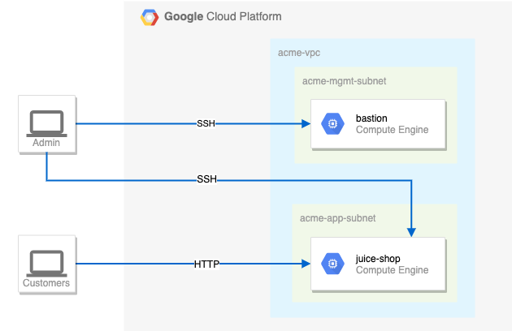
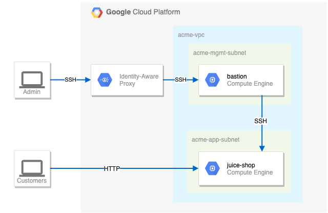

# Crea una red de Google Cloud segura: Lab de desafío

**GSP322**

### Situación del desafío

Supongamos que eres consultor de seguridad y que Julio, el dueño de una pequeña empresa local, te contrata para que lo ayudes con su exitoso sitio web (juice-shop). Julio es nuevo en Google Cloud y le pidió al hijo de su vecino que configurara el sitio inicial. Desde entonces, el hijo del vecino se encuentra en la universidad, pero antes de irse se aseguró de dejar el sitio en funcionamiento.

A continuación, se muestra la configuración actual:



### Tu desafío

Debes crear la configuración de seguridad adecuada para el sitio de Julio. Tu primer desafío consiste en configurar las reglas del firewall y las etiquetas de instancias de máquina virtual. Además, debes asegurarte de que el acceso SSH esté disponible únicamente al host de bastión a través de IAP.

Para las reglas del firewall, asegúrate de que se cumplan los siguientes aspectos:

El host de bastión no tiene una dirección IP pública.
Solo puedes tener acceso SSH al host de bastión y únicamente a través de IAP.
Solo puedes tener acceso SSH a juice-shop a través del host de bastión.
Solamente HTTP está abierto al público para juice-shop.
Sugerencias y trucos:

Presta especial atención a las etiquetas de red y a las reglas del firewall de VPC asociadas.
Sé específico y limita el tamaño de los rangos de origen de las reglas del firewall de VPC.
Los accesos demasiado permisivos se considerarán incorrectos.

El entorno de Google Cloud que se va a configurar


Orden de acción sugerido.

1. Revisa las reglas del firewall. Quita las reglas demasiado permisivas.

Para este paso debemos saber cuales son las [reglas de firewall predefinidas](https://cloud.google.com/firewall/docs/firewalls?hl=es)

Reglas predefinidas en la red predeterminada
La red predeterminada se rellena previamente con reglas de cortafuegos que permiten conexiones entrantes a las instancias. Estas reglas se pueden eliminar o modificar según sea necesario:

|Nombre de la regla|Dirección|Prioridad|Intervalos de origen|Acción|Protocolos y puertos|Descripción|
|:-----------------|:--------|:--------|:-------------------|:-----|:-------------------|:----------|
|default-allow-internal|ingress|65534|10.128.0.0/9|allow|tcp:0-65535<br>udp:0-65535<br>icmp|Permite las conexiones entrantes a instancias de VM desde otras instancias de la misma red VPC.|
|default-allow-ssh|ingress|65534|0.0.0.0/0|allow|tcp:22|Te permite conectarte a instancias con herramientas como ssh, scp o sftp.|
|default-allow-rdp|ingress|65534|0.0.0.0/0|allow|tcp:3389|Te permite conectarte a instancias mediante el protocolo de escritorio remoto (RDP) de Microsoft.|
|default-allow-icmp|ingress|65534|0.0.0.0/0|allow|tcp:icmp|Te permite usar herramientas como ping.|

Para manipular las reglas de firewall podemos ir a su [documentación](https://cloud.google.com/sdk/gcloud/reference/compute/firewall-rules)

```bash 
# Las siguientes variables son necesarias para todos los comandos del lab
# El ID del proyecto se encuentra en la página principal del lab
export PROJECT_ID=<Ingrese el ID del proyecto>

# La zona también se encuentran en la página principal
export ZONE=<Ingrese la zona del lab>

#esta variable no la da el lab pero con la zona se intuye la Region
export REGION=<Ingrese la región del lab>

#podemos listar las reglas de firewall con el siguiente comando
gcloud compute firewall-rules list

# Este comando cumple con el primer paso 
gcloud compute firewall-rules delete open-access --quiet
# Pero interpretando lo que piden aplicando el principio de 
# minimo privilegio y viendo que luego crearemos las reglas
# necesarias creo que deberiamos eliminar todas
gcloud compute firewall-rules delete default-allow-internal default-allow-rdp default-allow-icmp default-allow-ssh --quiet
```

2. Navega a Compute Engine en la consola de Cloud e identifica el host de bastión. La instancia no debe estar en ejecución. Inicia la instancia.

Ahora debemos trabajar con la instancia bastion [documentación](https://cloud.google.com/sdk/gcloud/reference/compute/instances)  

```bash 
gcloud compute instances start bastion --zone=${ZONE}
```

3. El host de bastión es la única máquina autorizada para recibir tráfico SSH externo. Crea una regla de firewall que permita el tráfico SSH (tcp/22) desde el servicio IAP. La regla de firewall se debe habilitar para la instancia de host de bastión mediante una etiqueta de red de SSH IAP network tag

```bash
export SSH_IAP_NETWORK_TAG=<coloque el nombre dado en el lab>
gcloud compute firewall-rules create ${SSH_IAP_NETWORK_TAG}\
    --allow=TCP:22\
    --source-ranges=35.235.240.0/20\
    --priority=1000\
    --network=acme-vpc\
    --target-tags=${SSH_IAP_NETWORK_TAG}\
    --description="IAP a Bastion"
```

ahora hay que agregar la etiqueta al recurso pertinente [documentación](https://cloud.google.com/vpc/docs/add-remove-network-tags?hl=es-419)

```bash
gcloud compute instances add-tags bastion\
    --zone ${ZONE}\
    --tags ${SSH_IAP_NETWORK_TAG}
```    

4. El servidor juice-shop entrega tráfico HTTP. Crea una regla de firewall que permita el tráfico en HTTP (tcp/80) a cualquier dirección. La regla de firewall se debe habilitar para la instancia de juice-shop mediante una etiqueta de red de HTTP network tag.

```bash
export HTTP_NETWORK_TAG=<coloque el nombre dado en el lab>
gcloud compute firewall-rules create ${HTTP_NETWORK_TAG}\
    --allow=TCP:80\
    --source-ranges=0.0.0.0/0\
    --priority=1000\
    --network=acme-vpc\
    --target-tags=${HTTP_NETWORK_TAG}\
    --description="Internet a Tienda Juice Shop"
```

igual que en el paso anterior agregamos la etiqueta al recurso pertinente

```bash
gcloud compute instances add-tags juice-shop\
    --zone ${ZONE}\
    --tags ${HTTP_NETWORK_TAG}
```    

5. Debes conectarte a juice-shop desde el host de bastión mediante SSH. Crea una regla de firewall que permita el tráfico mediante SSH (tcp/22) desde la dirección de red acme-mgmt-subnet. La regla de firewall se debe habilitar para la instancia de juice-shop mediante una etiqueta de red de SSH internal network tag.


Este paso presenta un problema, es que no conocemos el rango de ip del la subnet de acme-mgmt-subnet por lo cual tenemos que hallarlo [documentacion](https://cloud.google.com/sdk/gcloud/reference/compute/networks/subnets)


```bash
export IPCIDRRANGE=$(gcloud compute networks subnets describe acme-mgmt-subnet\
    --region=${REGION}\
    --format="value(ipCidrRange)")

export SSH_INTERNAL_NETWORK_TAG=<coloque el nombre dado en el lab>
gcloud compute firewall-rules create ${SSH_INTERNAL_NETWORK_TAG}\
    --allow=TCP:22\
    --source-ranges=${IPCIDRRANGE}\
    --priority=1000\
    --network=acme-vpc\
    --target-tags=${SSH_INTERNAL_NETWORK_TAG}\
    --description="Bastion a Tienda Juice Shop"

gcloud compute instances add-tags juice-shop\
    --zone ${ZONE}\
    --tags ${SSH_INTERNAL_NETWORK_TAG}
```

6. En la página de instancias de Compute Engine, haz clic en el botón SSH para conectarte al host de bastión. Una vez que te conectes, permite el acceso SSH a juice-shop. [Documentación](https://cloud.google.com/sdk/gcloud/reference/compute/ssh)


```bash 
# Conéctate al host bastion a través de Cloud Shell
gcloud compute ssh bastion --zone=${ZONE}

# Desde el bastion, intenta conectarte a la instancia de juice-shop
# Esto falla con un error de "Permission denied"
ssh juice-shop

# Solución temporal: Usa la consola de Google Cloud
# 1. Ve a Compute Engine > VM instances
# 2. En la fila de la instancia de "bastion", haz clic en SSH
# 3. En la nueva ventana, ejecuta el comando de conexión a juice-shop
ssh juice-shop
```

