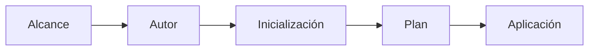

# IaC

Infraestructura como Código (IaC) es la práctica de gestionar y aprovisionar recursos de infraestructura mediante archivos de configuración legibles por máquinas, en lugar de procesos manuales. Esto permite versionar, automatizar y reproducir entornos de forma confiable.

## Caracteristicas

- **Declarativa:** Se define el "qué" (el estado final deseado) en lugar del "cómo" (los pasos para llegar a él). El sistema de IaC se encarga de calcular las acciones necesarias para alcanzar ese estado, lo que facilita la gestión de infraestructuras complejas y garantiza la consistencia.

- **Automatización:** Permite la automatización de la creación, actualización y eliminación de recursos de infraestructura, lo que reduce el riesgo de errores humanos y mejora la eficiencia operativa.

- **Versionable:** Al tratar la infraestructura como código, se pueden utilizar sistemas de control de versiones (como Git) para rastrear cambios, colaborar en equipo y revertir a estados anteriores si es necesario.

- **Reproducible:** Facilita la reproducción de entornos de infraestructura, lo que es especialmente útil para pruebas, desarrollo y producción, asegurando que los entornos sean consistentes y predecibles.

## IaC Configuracion de Flujo de Trabajo

### Etapas del Flujo de Trabajo

- **Alcance (Scope):** Determinar y definir qué recursos de infraestructura se necesitan para el proyecto. Consiste en la planificación arquitectónica y la identificación de dependencias antes de escribir el código.

- **Autor (Author):** Escribir los archivos de configuración en código (por ejemplo, usando HCL en Terraform o YAML/JSON para otras herramientas) donde se declara el estado final deseado de la infraestructura.

- **Inicialización (Initialize):** Preparar el directorio de trabajo local. En esta etapa, la herramienta de IaC descarga los plugins, módulos y proveedores (providers) necesarios para poder interactuar con las APIs de la nube (como Google Cloud, AWS, etc.).

- **Plan (Plan):** Generar una vista previa del plan de ejecución. La herramienta compara tu código con el estado actual de la infraestructura real y te muestra exactamente qué recursos se van a crear, modificar o eliminar. Es una etapa crucial de validación.

- **Aplicación (Apply):** Ejecutar los cambios propuestos en el plan. La herramienta de IaC realiza las llamadas correspondientes a las APIs del proveedor de la nube para aprovisionar o modificar la infraestructura real y llevarla al estado deseado estipulado en tu código.
