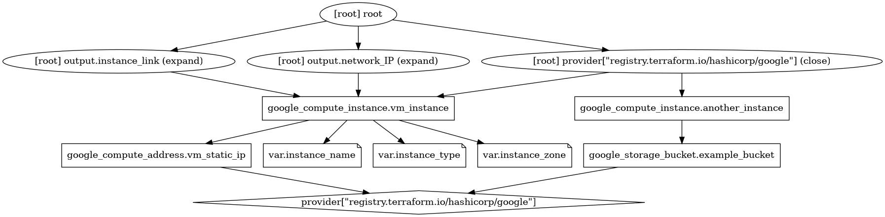

# Terraform

## Configuración archivo.tf

Un archivo de configuración de Terraform consiste en:

1. Un modulo root/
2. Cero o mas modulos hijos.
3. Variables.tf (opcional pero recomendado)
4. Outputs.tf (opcional pero recomendado)

HCL = HashiCorp Configuratoin Language

```HCL
<BLOCK TYPE> "<BLOCK LABEL>" "<BLOCK LABEL>" {
    #Block Body
    <IDENTIFIER> = <EXPRESSION> #Argument
}

resource "resource_type" "resource_name"{
    #Resource specific arguments
}
```

```HCL
resource "google_compute_network" "default"{
# custom mode network definition
    name = mynetwork
    auto_create_subnetworks = false
}

resource "google_storage_bucket" "example-bucket"{
# custom mode network definition
    name = "<unique-bucket-name>"
    location = "US"
}
```

providers.tf

```HCL
terraform {
  required_providers {
    google = {
      source  = "hashicorp/google"
      version = "~> 4.0"
    }
  }
}

provider "google" {
  project = var.project_id
  region  = var.region
}
```

outputs.tf

```HCL
output "bucket_URL" {
  value = google_storage_bucket.example-bucket.URL
}
```

salida

```bash
Outputs:
bucket_URL = "gs://<unique-bucket-name>"
```

variables.tf

```HCL
variable "db_password" {
  type        = string
  description = "Contraseña para la base de datos"
  default     = "admin123"
  sensitive   = true
}

# type: Define el tipo de dato (string, number, bool, list, map, object).
# default: Valor por defecto si no se proporciona uno.
# sensitive: Si es true, oculta el valor en la salida de la consola (logs/plan).
```

## Terraform comandos

- `terraform init`: Inicializa el directorio de trabajo, descargando los plugins y proveedores necesarios.

- `terraform plan`: Muestra un plan de ejecución, indicando qué acciones se tomarán para alcanzar el estado deseado.

- `terraform apply`: Aplica los cambios necesarios para alcanzar el estado deseado, creando, modificando o eliminando recursos según sea necesario.

- `terraform destroy`: Elimina toda la infraestructura creada por Terraform, devolviendo el entorno a su estado original.

- `terraform fmt`: Formatea los archivos de configuración de Terraform para mejorar la legibilidad y mantener un estilo consistente.

- `terraform graph`:

```bash
terraform graph | dot -Tpng > graph.png
```



Para comprender cómo leer este gráfico, visita esta [página](https://developer.hashicorp.com/terraform/internals/graph)

- `terraform validate`: Valida la sintaxis y la configuración de los archivos `.tf` para asegurarse de que sean correctos antes de aplicar cualquier cambio.

## Comandos

- `terraform`:

- `terraform version`: Se usa para mostrar la version de terraform instalada

```bash
terraform version
#Salida
Terraform v1.5.7
on linux_amd64

Your version of Terraform is out of date! The latest version
is 1.15.3. You can update by downloading from https://www.terraform.io/downloads.html
```

- `terraform init`:
  Se utiliza para inicializar un directorio de trabajo que contiene archivos de configuración de Terraform. Es el primer comando que debe ejecutarse después de escribir una nueva configuración o clonar una existente. Realiza las siguientes acciones:
  - Descarga e instala los **providers** (proveedores) necesarios (como Google Cloud, AWS, etc.).
  - Inicializa el **backend** para almacenar el archivo de estado (`terraform.tfstate`).
  - Descarga los módulos hijos referenciados en la configuración.

```bash
Initializing the backend...

Initializing provider plugins...
- Finding latest version of hashicorp/google...
- Installing hashicorp/google v7.32.0...
- Installed hashicorp/google v7.32.0 (signed by HashiCorp)

Terraform has created a lock file .terraform.lock.hcl to record the provider
selections it made above. Include this file in your version control repository
so that Terraform can guarantee to make the same selections by default when
you run "terraform init" in the future.

Terraform has been successfully initialized!

You may now begin working with Terraform. Try running "terraform plan" to see
any changes that are required for your infrastructure. All Terraform commands
should now work.

If you ever set or change modules or backend configuration for Terraform,
rerun this command to reinitialize your working directory. If you forget, other
commands will detect it and remind you to do so if necessary.
```

`terraform plan`:Crea un plan de ejecución. Terraform realiza una lectura del estado actual de cualquier objeto de infraestructura ya existente para asegurarse de que el estado de Terraform esté actualizado. Luego, compara el estado actual con la configuración deseada (tu código) y determina qué acciones son necesarias para lograr el estado configurado (crear, actualizar o destruir recursos).

- No realiza cambios reales en la infraestructura.
- Permite al usuario revisar los cambios antes de aplicarlos.
- Puede guardarse en un archivo de salida para asegurar que

```bash
terraform plan

Terraform used the selected providers to generate the following execution plan.
Resource actions are indicated with the following symbols:
  + create

Terraform will perform the following actions:

  # google_compute_instance.terraform will be created
  + resource "google_compute_instance" "terraform" {
      + can_ip_forward       = false
      + cpu_platform         = (known after apply)
      + creation_timestamp   = (known after apply)
      + current_status       = (known after apply)
      + deletion_protection  = false
      + effective_labels     = {
          + "goog-terraform-provisioned" = "true"
        }
      + id                   = (known after apply)
      + instance_id          = (known after apply)
      + label_fingerprint    = (known after apply)
      + machine_type         = "e2-micro"
      + metadata_fingerprint = (known after apply)
      + min_cpu_platform     = (known after apply)
      + name                 = "terraform"
      + project              = "qwiklabs-gcp-00-58df6e967e71"
      + self_link            = (known after apply)
      + tags_fingerprint     = (known after apply)
      + terraform_labels     = {
          + "goog-terraform-provisioned" = "true"
        }
      + zone                 = "us-west1-b"

      + boot_disk {
          + auto_delete                = true
          + device_name                = (known after apply)
          + disk_encryption_key_sha256 = (known after apply)
          + guest_os_features          = (known after apply)
          + kms_key_self_link          = (known after apply)
          + mode                       = "READ_WRITE"
          + source                     = (known after apply)

          + initialize_params {
              + architecture           = (known after apply)
              + image                  = "debian-cloud/debian-11"
              + labels                 = (known after apply)
              + provisioned_iops       = (known after apply)
              + provisioned_throughput = (known after apply)
              + resource_policies      = (known after apply)
              + size                   = (known after apply)
              + snapshot               = (known after apply)
              + type                   = (known after apply)
            }
        }

      + network_interface {
          + igmp_query                  = (known after apply)
          + internal_ipv6_prefix_length = (known after apply)
          + ipv6_access_type            = (known after apply)
          + ipv6_address                = (known after apply)
          + name                        = (known after apply)
          + network                     = "default"
          + network_attachment          = (known after apply)
          + network_ip                  = (known after apply)
          + parent_nic_name             = (known after apply)
          + stack_type                  = (known after apply)
          + subnetwork                  = (known after apply)
          + subnetwork_project          = (known after apply)

          + access_config {
              + nat_ip       = (known after apply)
              + network_tier = (known after apply)
            }
        }
    }

Plan: 1 to add, 0 to change, 0 to destroy.
```

- `terraform apply` ejecute exactamente lo planeado.

```bash
terraform apply

Terraform used the selected providers to generate the following execution plan.
Resource actions are indicated with the following symbols:
  + create

Terraform will perform the following actions:

  # google_compute_instance.terraform will be created
  + resource "google_compute_instance" "terraform" {
      + can_ip_forward       = false
      + cpu_platform         = (known after apply)
      + creation_timestamp   = (known after apply)
      + current_status       = (known after apply)
      + deletion_protection  = false
      + effective_labels     = {
          + "goog-terraform-provisioned" = "true"
        }
      + id                   = (known after apply)
      + instance_id          = (known after apply)
      + label_fingerprint    = (known after apply)
      + machine_type         = "e2-micro"
      + metadata_fingerprint = (known after apply)
      + min_cpu_platform     = (known after apply)
      + name                 = "terraform"
      + project              = "qwiklabs-gcp-00-58df6e967e71"
      + self_link            = (known after apply)
      + tags_fingerprint     = (known after apply)
      + terraform_labels     = {
          + "goog-terraform-provisioned" = "true"
        }
      + zone                 = "us-west1-b"

      + boot_disk {
          + auto_delete                = true
          + device_name                = (known after apply)
          + disk_encryption_key_sha256 = (known after apply)
          + guest_os_features          = (known after apply)
          + kms_key_self_link          = (known after apply)
          + mode                       = "READ_WRITE"
          + source                     = (known after apply)

          + initialize_params {
              + architecture           = (known after apply)
              + image                  = "debian-cloud/debian-11"
              + labels                 = (known after apply)
              + provisioned_iops       = (known after apply)
              + provisioned_throughput = (known after apply)
              + resource_policies      = (known after apply)
              + size                   = (known after apply)
              + snapshot               = (known after apply)
              + type                   = (known after apply)
            }
        }

      + network_interface {
          + igmp_query                  = (known after apply)
          + internal_ipv6_prefix_length = (known after apply)
          + ipv6_access_type            = (known after apply)
          + ipv6_address                = (known after apply)
          + name                        = (known after apply)
          + network                     = "default"
          + network_attachment          = (known after apply)
          + network_ip                  = (known after apply)
          + parent_nic_name             = (known after apply)
          + stack_type                  = (known after apply)
          + subnetwork                  = (known after apply)
          + subnetwork_project          = (known after apply)

          + access_config {
              + nat_ip       = (known after apply)
              + network_tier = (known after apply)
            }
        }
    }

Plan: 1 to add, 0 to change, 0 to destroy.

Do you want to perform these actions?
  Terraform will perform the actions described above.
  Only 'yes' will be accepted to approve.

Enter a value: yes

google_compute_instance.terraform: Creating...
google_compute_instance.terraform: Still creating... [10s elapsed]
google_compute_instance.terraform: Still creating... [20s elapsed]
google_compute_instance.terraform: Creation complete after 22s [id=projects/qwiklabs-gcp-00-58df6e967e71/zones/us-west1-b/instances/terraform]

Apply complete! Resources: 1 added, 0 changed, 0 destroyed.
```

`terraform destroy`: Se utiliza para eliminar de forma segura y predecible toda la infraestructura gestionada por un proyecto de Terraform.

- Al igual que `plan`, primero genera un plan de destrucción para mostrar qué recursos serán eliminados.

- Solicita confirmación antes de proceder.

- Es el proceso inverso a `apply`, asegurando que no queden recursos activos que generen costos innecesarios.

```bash
terraform destroy
google_compute_instance.terraform: Refreshing state... [id=projects/qwiklabs-gcp-00-58df6e967e71/zones/us-west1-b/instances/terraform]

Terraform used the selected providers to generate the following execution plan.
Resource actions are indicated with the following symbols:
  - destroy

Terraform will perform the following actions:

  # google_compute_instance.terraform will be destroyed
  - resource "google_compute_instance" "terraform" {
      - allow_stopping_for_update = true -> null
      - can_ip_forward            = false -> null
      - cpu_platform              = "Intel Broadwell" -> null
      - creation_timestamp        = "2026-05-16T13:33:13.932-07:00" -> null
      - current_status            = "RUNNING" -> null
      - deletion_protection       = false -> null
      - effective_labels          = {
          - "goog-terraform-provisioned" = "true"
        } -> null
      - enable_display            = false -> null
      - id                        = "projects/qwiklabs-gcp-00-58df6e967e71/zones/us-west1-b/instances/terraform" -> null
      - instance_id               = "6659200354273815143" -> null
      - label_fingerprint         = "vezUS-42LLM=" -> null
      - labels                    = {} -> null
      - machine_type              = "e2-medium" -> null
      - metadata                  = {} -> null
      - metadata_fingerprint      = "LY9Ds6E0syQ=" -> null
      - name                      = "terraform" -> null
      - project                   = "qwiklabs-gcp-00-58df6e967e71" -> null
      - resource_policies         = [] -> null
      - self_link                 = "https://www.googleapis.com/compute/v1/projects/qwiklabs-gcp-00-58df6e967e71/zones/us-west1-b/instances/terraform" -> null
      - tags                      = [
          - "dev",
          - "web",
        ] -> null
      - tags_fingerprint          = "XaeQnaHMn9Y=" -> null
      - terraform_labels          = {
          - "goog-terraform-provisioned" = "true"
        } -> null
      - zone                      = "us-west1-b" -> null

      - boot_disk {
          - auto_delete       = true -> null
          - device_name       = "persistent-disk-0" -> null
          - force_attach      = false -> null
          - guest_os_features = [
              - "UEFI_COMPATIBLE",
              - "VIRTIO_SCSI_MULTIQUEUE",
              - "GVNIC",
            ] -> null
          - mode              = "READ_WRITE" -> null
          - source            = "https://www.googleapis.com/compute/v1/projects/qwiklabs-gcp-00-58df6e967e71/zones/us-west1-b/disks/terraform" -> null

          - initialize_params {
              - architecture                = "X86_64" -> null
              - enable_confidential_compute = false -> null
              - image                       = "https://www.googleapis.com/compute/v1/projects/debian-cloud/global/images/debian-11-bullseye-v20260513" -> null
              - labels                      = {} -> null
              - provisioned_iops            = 0 -> null
              - provisioned_throughput      = 0 -> null
              - replica_zones               = [] -> null
              - resource_manager_tags       = {} -> null
              - resource_policies           = [] -> null
              - size                        = 10 -> null
              - type                        = "pd-standard" -> null
            }
        }

      - network_interface {
          - internal_ipv6_prefix_length = 0 -> null
          - name                        = "nic0" -> null
          - network                     = "https://www.googleapis.com/compute/v1/projects/qwiklabs-gcp-00-58df6e967e71/global/networks/default" -> null
          - network_ip                  = "10.138.0.2" -> null
          - queue_count                 = 0 -> null
          - stack_type                  = "IPV4_ONLY" -> null
          - subnetwork                  = "https://www.googleapis.com/compute/v1/projects/qwiklabs-gcp-00-58df6e967e71/regions/us-west1/subnetworks/default" -> null
          - subnetwork_project          = "qwiklabs-gcp-00-58df6e967e71" -> null
          - vlan                        = 0 -> null

          - access_config {
              - nat_ip       = "34.11.166.249" -> null
              - network_tier = "PREMIUM" -> null
            }
        }

      - scheduling {
          - automatic_restart   = true -> null
          - availability_domain = 0 -> null
          - min_node_cpus       = 0 -> null
          - on_host_maintenance = "MIGRATE" -> null
          - preemptible         = false -> null
          - provisioning_model  = "STANDARD" -> null
        }

      - shielded_instance_config {
          - enable_integrity_monitoring = true -> null
          - enable_secure_boot          = false -> null
          - enable_vtpm                 = true -> null
        }
    }

Plan: 0 to add, 0 to change, 1 to destroy.

Do you really want to destroy all resources?
  Terraform will destroy all your managed infrastructure, as shown above.
  There is no undo. Only 'yes' will be accepted to confirm.

  Enter a value: yes

google_compute_instance.terraform: Destroying... [id=projects/qwiklabs-gcp-00-58df6e967e71/zones/us-west1-b/instances/terraform]
google_compute_instance.terraform: Still destroying... [id=projects/qwiklabs-gcp-00-58df6e967e71/zones/us-west1-b/instances/terraform, 10s elapsed]
google_compute_instance.terraform: Still destroying... [id=projects/qwiklabs-gcp-00-58df6e967e71/zones/us-west1-b/instances/terraform, 20s elapsed]
google_compute_instance.terraform: Still destroying... [id=projects/qwiklabs-gcp-00-58df6e967e71/zones/us-west1-b/instances/terraform, 30s elapsed]
google_compute_instance.terraform: Still destroying... [id=projects/qwiklabs-gcp-00-58df6e967e71/zones/us-west1-b/instances/terraform, 40s elapsed]
google_compute_instance.terraform: Still destroying... [id=projects/qwiklabs-gcp-00-58df6e967e71/zones/us-west1-b/instances/terraform, 50s elapsed]
google_compute_instance.terraform: Still destroying... [id=projects/qwiklabs-gcp-00-58df6e967e71/zones/us-west1-b/instances/terraform, 1m0s elapsed]
google_compute_instance.terraform: Destruction complete after 1m1s

Destroy complete! Resources: 1 destroyed.
```

## Estructura

- `main.tf`: Archivo principal donde se definen los recursos y la infraestructura.

```HCL
terraform {
  required_providers {
    google = {
      source = "hashicorp/google"
    }
  }
}

provider "google" {

  project = "qwiklabs-gcp-00-58df6e967e71"
  region  = "us-west1"
  zone    = "us-west1-b"
}

# Infraestructura

resource "google_compute_instance" "terraform" {
  name         = "terraform"
  machine_type = "e2-micro"
  boot_disk {
    initialize_params {
      image = "debian-cloud/debian-11"
    }
  }
  #importante definir la interfaz de red
  network_interface {
    network = "default"
    access_config {
    }
  }
}
```

---

provider.tf

```HCL
  provider "google" {
  project = "qwiklabs-gcp-02-1de08361fa5e"
  region  = "europe-west4"
  zone    = "europe-west4-a"
}
```

---

instance.tf

```HCL
resource "google_compute_address" "vm_static_ip" {
  name = "terraform-static-ip"
}
resource google_compute_instance "vm_instance" {
  name         = "${var.instance_name}"
  zone         = "${var.instance_zone}"
  machine_type = "${var.instance_type}"
  boot_disk {
    initialize_params {
      image = "debian-cloud/debian-11"
      }
  }
  network_interface {
    network = "default"
    access_config {
      # Asígnale una IP con NAT uno a uno a la instancia
      nat_ip = google_compute_address.vm_static_ip.address
    }
  }
}
```

---

variables.tf

```HCL
variable "instance_name" {
  type        = string
  description = "Name for the Google Compute instance"
}
variable "instance_zone" {
  type        = string
  description = "Zone for the Google Compute instance"
}
variable "instance_type" {
  type        = string
  description = "Disk type of the Google Compute instance"
  default     = "e2-medium"
  }
```

---

outputs.tf

```HCL
output "network_IP" {
  value = google_compute_instance.vm_instance.instance_id
  description = "The internal ip address of the instance"
}
output "instance_link" {
  value = google_compute_instance.vm_instance.self_link
  description = "The URI of the created resource."
}
```

### Depenedncias Explicitas

exp.tf

````HCL
# Crea una instancia nueva que utiliza el bucket
resource "google_compute_instance" "another_instance" {

  name         = "terraform-instance-2"
  machine_type = "e2-micro"
  boot_disk {
    initialize_params {
      image = "debian-cloud/debian-11"
    }
  }
  network_interface {
    network = "default"
    access_config {
    }
  }
  # Le indica a Terraform que esta instancia de VM debe crearse solo después de que
  # se haya creado el bucket de almacenamiento.
  depends_on = [google_storage_bucket.example_bucket]
}

Se debe agregar la creacion del bucket al fnal del archivo instance.tf

```HCL
# Recurso nuevo para el bucket de almacenamiento que utilizará nuestra aplicación.
resource "google_storage_bucket" "example_bucket" {
  name     = "qwiklabs-gcp-02-1de08361fa5e-2026-05-17"
  location = "US"
  website {
    main_page_suffix = "index.html"
    not_found_page   = "404.html"
  }
}
````

> [!NOTE]
> Los buckets de almacenamiento deben ser únicos a nivel global, por lo que tendrás que reemplazar `UNIQUE-BUCKET-NAME` por un nombre válido y único para un bucket. Una buena manera de hacerlo es usar el nombre del proyecto y la fecha.

---

## Metaargumentos

- `depends_on`: Permite especificar dependencias explícitas entre recursos, asegurando que Terraform cree o destruya los recursos en el orden correcto.

- `count`: Permite crear múltiples instancias de un recurso a partir de una sola definición, utilizando un índice para diferenciar cada instancia.

- `for_each`: Similar a `count`, pero permite iterar sobre un conjunto de valores (como una lista o un mapa) para crear múltiples recursos con claves significativas.

- `lifecycle`: Permite controlar el comportamiento de los recursos durante su creación, actualización o destrucción, con opciones como `create_before_destroy` o `prevent_destroy`.

- `provider`: Permite especificar un proveedor diferente para un recurso específico, útil cuando se utilizan múltiples proveedores en la misma configuración.

- `provisioner`: Permite ejecutar comandos o scripts en los recursos después de que se hayan creado, útil para configuraciones adicionales o tareas de inicialización.

- `connection`: Se utiliza junto con `provisioner` para definir cómo Terraform se conecta a los recursos (por ejemplo, mediante SSH) para ejecutar comandos o scripts.

```HCL
# Ejercicio: Uso de Metaargumentos

# 1. depends_on: Asegura que el bucket exista antes que la instancia
resource "google_storage_bucket" "static_assets" {
  name     = "assets-${var.project_id}"
  location = "US"
}

# 2. count: Crea 2 instancias de base de datos idénticas
resource "google_compute_instance" "db_nodes" {
  count        = 2
  name         = "db-node-${count.index}"
  machine_type = "e2-micro"
  zone         = "us-west1-b"

  boot_disk {
    initialize_params { image = "debian-cloud/debian-11" }
  }
  network_interface { network = "default" }

  # Dependencia explícita
  depends_on = [google_storage_bucket.static_assets]
}

# 3. for_each: Crea subredes basadas en un mapa de regiones
variable "subnets" {
  type    = map(string)
  default = {
    subnet-1 = "us-central1"
    subnet-2 = "us-east1"
  }
}

resource "google_compute_subnetwork" "network_with_for_each" {
  for_each      = var.subnets
  name          = each.key
  ip_cidr_range = "10.0.${index(keys(var.subnets), each.key)}.0/24"
  region        = each.value
  network       = "default"
}

# 4. lifecycle: Protege un recurso crítico
resource "google_compute_network" "main_vpc" {
  name = "main-vpc"

  lifecycle {
    # Evita que el recurso sea destruido accidentalmente con terraform destroy
    prevent_destroy = true
    # Crea el reemplazo antes de destruir el anterior si hay cambios críticos
    create_before_destroy = true
  }
}
```

## Módulos de Terraform

Un módulo de Terraform es un contenedor de recursos de infraestructura que se pueden reutilizar. Permite organizar y encapsular la configuración de Terraform en unidades lógicas, facilitando la gestión y el mantenimiento de infraestructuras complejas.

```HCL
module "network" {
  source = "./modules/network"

  network_name = "my-network"
  region       = "us-west1"
}
```

**Ventajas:**

- Reutilización de código: Permite reutilizar configuraciones comunes en múltiples proyectos o entornos.

- Organización: Facilita la organización de la infraestructura en componentes lógicos y manejables.

- Mantenimiento: Facilita el mantenimiento y la actualización de la infraestructura al centralizar la lógica en módulos.

**Estructura de un módulo:**

```
modules/
  network/
    main.tf
    variables.tf
    outputs.tf
```

En este ejemplo, el módulo `network` se encuentra en el directorio `modules/network/` y contiene su propia configuración (`main.tf`), variables (`variables.tf`) y salidas (`outputs.tf`). Al llamar al módulo desde la configuración principal, se pueden pasar parámetros para personalizar su comportamiento.

### Fuentes de los módulos de Terraform

- **Módulos locales:** Se encuentran en el mismo repositorio o sistema de archivos que la configuración principal. Se referencian utilizando una ruta relativa (`./modules/network`).

- **Módulos remotos:** Se almacenan en repositorios externos, como GitHub, GitLab o el Registro de Módulos de Terraform. Se referencian utilizando una URL

**Ejemplo de un módulo remoto Terradorm Registry:**

```HCL
module "web_server"{
  source = "terraform-google-module/vm/google//module/compute_instance"
  versiom = "0.0.5" #Solo soportado en Terraform Registry
}
```

**Ejemplo de un módulo remoto GitHub:**

```HCL
module "web_server"{
  source = "github.com/usuario/repositorio//ruta/al/modulo"
}
```
