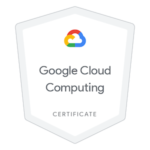
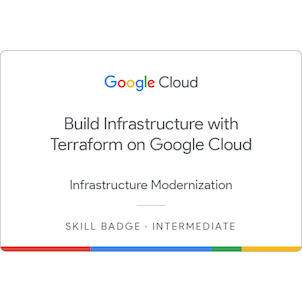
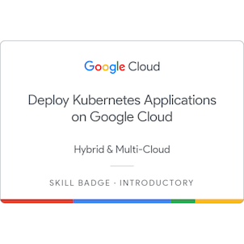
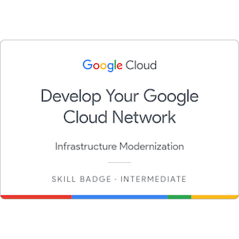
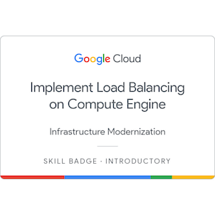
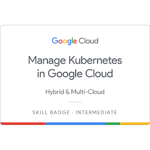
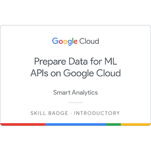
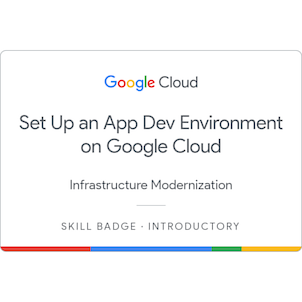

# ☁️ Google Cloud Platform – Soluciones y Prácticas

  

Bienvenido a este repositorio, donde documento mis soluciones, prácticas y aprendizajes en **Google Cloud Platform (GCP)**.  
El objetivo es consolidar conocimientos, aplicar buenas prácticas y compartir ejemplos que pueden servir de guía a otros estudiantes y profesionales de la nube.

---

## 🏅 Certificaciones

Para respaldar y validar mis conocimientos técnicos en la nube de Google, he obtenido las siguientes certificaciones oficiales:

| Certificación | Insignia | Credencial |
| :--- | :---: | :---: |
| **Google Cloud Certified - Associate Cloud Engineer** |  | [Verificar en Credly](https://www.credly.com/badges/0ac27d14-74b4-49ea-bc84-3dc0883be183/public_url) |
| **Google Cloud Computing Foundations Certificate** |  | [Verificar en Credly](https://www.credly.com/badges/a1895a28-3ab1-42a2-a380-dac4886e8bb7/public_url) |

---

## 🎖️ Skill Badges (Insignias de Google Cloud)

Insignias oficiales obtenidas al completar las misiones y laboratorios de desafío (Challenge Labs) en Google Cloud Skills Boost:

| Insignia | Detalle de Habilidad | Credencial |
| :---: | :--- | :---: |
|  | **Build a Secure Google Cloud Network** Diseño y configuración de redes seguras en GCP, incluyendo VPCs, Firewalls, balanceadores y acceso seguro mediante bastidores.  *Ejercicios relacionados:* [`(GSP322) Red de Google Cloud segura`](./(GSP322)Red-de-Google-Cloud-segura/README.MD) | [Verificar](https://www.credly.com/badges/4321f6a8-ae2c-4d21-b7f1-6115696e90ba/public_url) |
|  | **Build Infrastructure with Terraform on Google Cloud** Despliegue y administración automatizada de infraestructura de GCP utilizando Terraform.  *Ejercicios relacionados:* [`IaC / Terraform`](./IaC/Terraform.md) | [Verificar](https://www.credly.com/badges/2c5909f5-37df-4258-a199-29acbf79f8e9/public_url) |
|  | **Cloud Architecture: Design, Implement, and Manage** Diseño y administración de arquitecturas robustas y escalables en GCP utilizando Compute Engine, GKE y redes. | [Verificar](https://www.credly.com/badges/6e28afa7-cbdd-4b7e-a5a3-c211d14c4b97/public_url) |
|  | **Deploy Kubernetes Applications on Google Cloud** Despliegue, configuración y escalamiento de aplicaciones contenerizadas en Google Kubernetes Engine (GKE).  *Ejercicios relacionados:* [`(GSP304) Crea e implementa una imagen de Docker...`](./(GSP304)Crea-e-implementa-una-imagen-de%20Docker-para-un-clúster-de-Kubernetes/README.md) y [`(GSP305) Escala horizontalmente...`](./(GSP305)Escala-horizontalmente-una-aplicación-alojada-en-contenedores-y-actualízala-en-un-clúster-de-Kubernetes/README.md) | [Verificar](https://www.credly.com/badges/39785e4b-a9ec-4542-9487-1b5a7589f922/public_url) |
|  | **Develop your Google Cloud Network** Configuración avanzada de red en GCP, conectividad híbrida, enrutamiento y balanceo de cargas. | [Verificar](https://www.credly.com/badges/6b850d7f-a647-4c1e-8ba7-d5291e0bf685/public_url) |
|  | **Engineer AI Agents with Agent Development Kit (ADK)** Desarrollo de agentes de Inteligencia Artificial utilizando herramientas y SDKs nativos de Google Cloud.  *Ejercicios relacionados:* [`ADK`](./ADK) | [Verificar](https://www.credly.com/badges/5dc35dc9-4ee2-48ee-b9ed-02e43bedbff2/public_url) |
|  | **Implement Cloud Security Fundamentals on Google Cloud** Aplicación de principios de seguridad en la nube, gestión de accesos (IAM), y configuración de redes e infraestructuras seguras.  *Ejercicios relacionados:* [`(GSP303) RDP seguro con host de bastión`](./(GSP303)Configura-el-RDP-seguro-con-un-host-de-bastión-de-Windows/README.md) | [Verificar](https://www.credly.com/badges/1ccc6a5a-c9f1-4159-b5cb-0b90c988a220/public_url) |
|  | **Implement Load Balancing on Compute Engine** Configuración y optimización de balanceadores de carga de aplicaciones e infraestructura en Compute Engine.  *Ejercicios relacionados:* [`Implementa Cloud Load Balancing para Compute Engine`](./Implementa-Cloud-Load-Balancing-para-Compute-Engine) y [`(GSP313) Implementa el balanceo de cargas`](./(GSP313)Implementa-el-balanceo-de-cargas/README.md) | [Verificar](https://www.credly.com/badges/42c45043-283a-4c68-97e9-ba7b61ca7751/public_url) |
|  | **Manage Kubernetes in Google Cloud** Administración, monitoreo y mantenimiento de clústeres de Kubernetes de producción en GKE.  *Ejercicios relacionados:* [`(GSP510) Administra Kubernetes en Google Cloud`](./(GSP510)Administra-Kubernetes-en-Google-Cloud/README.md) | [Verificar](https://www.credly.com/badges/7ed4e973-8084-4307-af08-c62690af07cf/public_url) |
|  | **Prepare Data for ML APIs on Google Cloud** Preparación, limpieza y procesamiento de datos para modelos e integraciones de machine learning.  *Ejercicios relacionados:* [`(GSP323) Prepara datos para las APIs de AA en Google Cloud`](./(GSP323)Prepara-datos-for-las-APIs-de-AA-en-Google-Cloud/README.md) | [Verificar](https://www.credly.com/badges/8237ab98-0410-48f0-a111-5264e8c0a009/public_url) |
|  | **Prompt Design in Vertex AI** Ingeniería de Prompts y uso de modelos de lenguaje de gran tamaño (LLMs) dentro de la suite de Vertex AI en GCP. | [Verificar](https://www.credly.com/badges/8237ab98-0410-48f0-a111-5264e8c0a009/public_url) |
|  | **Set up an App Dev Environment on Google Cloud** Creación y despliegue de entornos listos para el desarrollo y producción de aplicaciones web y microservicios en GCP.  *Ejercicios relacionados:* [`(GSP315) Entorno de desarrollo de apps`](./(GSP315)Configura-un-entorno-de-desarrollo-de-apps-enGoogle-Cloud/README.md) | [Verificar](https://www.credly.com/badges/fa6d277b-cc65-46c9-9da2-56c719983c9d/public_url) |

---

## 📂 Estructura del repositorio

Cada carpeta corresponde a un reto, práctica o solución implementada en GCP. Dentro encontrarás los pasos, código y configuraciones necesarias.

- Implementa Cloud Load Balancing para Compute Engine
  - [`(GSP007)-Configura balanceadores de cargas de red`](<./Implementa-Cloud-Load-Balancing-para-Compute-Engine/(GSP007)Configurar-balanceadores-de-cargas-de-red/README.md>)
    En este lab práctico, aprenderás a configurar un balanceador de cargas de red (NLB) de transferencia que se ejecute en máquinas virtuales (VMs) de Compute Engine. Un NLB de capa 4 (L4) controla el tráfico según la información a nivel de la red, como las direcciones IP y los números de puerto, y no inspecciona el contenido del tráfico.
  - [`(GSP155)-Configura balanceadores de cargas de aplicaciones`](<./Implementa-Cloud-Load-Balancing-para-Compute-Engine/(GSP155)Configura-balanceadores-de-cargas-de-aplicaciones/README.md>)
    En este lab práctico, aprenderás a configurar un balanceador de cargas de aplicaciones de capa 7 (L7) en máquinas virtuales (VMs) de Compute Engine. Los balanceadores de cargas L7 pueden comprender los protocolos HTTP(S), lo que les permite tomar decisiones de enrutamiento basadas en parámetros como la URL, los encabezados, las cookies y el contenido de la solicitud. Esto permite mejorar el rendimiento y la capacidad de respuesta de las aplicaciones.
- [`(GSP101)-Implementa un sitio web y soluciona problemas`](<./(GSP101)Implementa-un-sitio-web-y-soluciona-problemas/README.md>)  
  Tu desafío es implementar el sitio en la nube pública. Para ello, debes completar las tareas que aparecen a continuación. En este ejercicio, usarás un servidor web Apache sencillo como marcador de posición para el sitio nuevo. ¡Buena suerte!
- [`(GSP303)-Configura el RDP seguro con un host de bastión de Windows`](<./(GSP303)Configura-el-RDP-seguro-con-un-host-de-bastión-de-Windows/README.md>)
  Implementar la máquina de Windows segura que no está configurada para la comunicación externa dentro de una nueva subred de VPC. Luego, implementar Microsoft Internet Information Server en dicha máquina segura. A los fines de este lab, todos los recursos se deben aprovisionar en la siguiente región y zona
- [`(GSP304)-Crea e implementa una imagen de Docker para un clúster de Kubernetes`](<./(GSP304)Crea-e-implementa-una-imagen-de Docker-para-un-clúster-de-Kubernetes/README.md>)
  Tu equipo de desarrollo desea adoptar un enfoque de microservicios alojados en contenedores para la arquitectura de aplicaciones. Debes probar la aplicación de ejemplo que te proporcionaron para garantizar que se pueda implementar en un contenedor de Google Kubernetes. El grupo de desarrollo proporcionó una aplicación sencilla en Go, llamada `echo-web`, con un Dockerfile y el contexto asociado, para que puedas crear una imagen de Docker inmediatamente.
- [`(GSP305)-Escala horizontalmente una aplicación alojada en contenedores y actualízala en un clúster de Kubernetes`](<./(GSP305)Escala-horizontalmente-una-aplicación-alojada-en-contenedores-y-actualízala-en-un-clúster-de-Kubernetes/README.md>)
  Debes actualizar el código v1 de la aplicación `echo-app` en ejecución en la implementación `echo-web` al código v2 que recibiste. También debes escalar la aplicación horizontalmente a 2 instancias y confirmar que se estén ejecutando.
- [`(GSP306)-Migra una base de datos MySQL a Google Cloud SQL`](<./(GSP306)Migra-una-base-de-datos-MySQL-a-Google-Cloud-SQL/README.md>)
  Tu desafío es migrar la base de datos a Cloud SQL y, luego, volver a configurar la aplicación para que ya no dependa de la base de datos MySQL local. ¡Buena suerte!
- [`(GSP313)-Implementa el balanceo de cargas`](<./(GSP313)Implementa-el-balanceo-de-cargas/README.md>)  
  Configuración de un **Load Balancer** en GCP para distribuir el tráfico entre múltiples instancias, asegurando alta disponibilidad y escalabilidad.
- [`(GSP315)-Configura un entorno de desarrollo de apps en Google Cloud`](<./(GSP315)Configura-un-entorno-de-desarrollo-de-apps-enGoogle-Cloud/README.md>)  
  Configuración de las herramientas y servicios esenciales de Google Cloud para crear un entorno de desarrollo robusto y eficiente.
- [`(GSP322)-Red de Google Cloud segura`](<./(GSP322)Red-de-Google-Cloud-segura/README.md>)
  Diseño e implementación de una red en Google Cloud con políticas de seguridad, reglas de firewall y controles de acceso para proteger los recursos y el tráfico.
- [`(GSP323)-Prepara datos para las APIs de AA en Google Cloud`](<./(GSP323)Prepara-datos-para-las-APIs-de-AA-en-Google-Cloud/README.md>)
  Proceso de preparación, limpieza y transformación de datos para su uso en APIs de aprendizaje automático (AA) dentro de Google Cloud, asegurando calidad y compatibilidad.
- [`(GSP510)-Administra Kubernetes en Google Cloud`](<./(GSP510)Administra-Kubernetes-en-Google-Cloud/README.md>)
  Como parte del entorno de la zona de pruebas, tus desarrolladores crearon un repositorio de Artifact Registry llamado ==cluster name==, que incluye un fragmento de código con una aplicación de ejemplo básica que implementarás en un clúster.

_(La lista se irá ampliando conforme agregue más soluciones.)_

---

## 📚 Guías y Referencias Generales

La documentación teórica y guías sobre los diferentes servicios de GCP se encuentran organizadas por categorías en la carpeta de servicios:

👉 **[Ver el Índice de Servicios de GCP (GCP Services Index)](./services/README.md)**

También puedes consultar otras referencias rápidas:
- [`Comandos de GCP`](./Comandos/indice.md)  
  Hoja de referencia con los comandos de `gcloud`.

---

## 🛠️ Tecnologías y servicios de GCP usados

- Compute Engine
- Cloud Load Balancing
- Cloud Shell / gcloud CLI
- (y otros que se vayan incorporando)

---

## 🎯 Objetivos del repositorio

- Reforzar conceptos clave de arquitectura en la nube.
- Documentar configuraciones y buenas prácticas.
- Mostrar casos de uso reales con GCP.

---

## 📌 Próximos pasos

✔️ Continuar agregando soluciones prácticas de GCP.  
✔️ Integrar diagramas de arquitectura.  
✔️ Documentar comandos y scripts reutilizables.

---

## 📄 Licencia

Este repositorio está bajo la licencia **MIT**, por lo que puedes usarlo y adaptarlo libremente.

---

✍️ \_Autor: [Daniel Jiménez](https://github.com/stonedjjh)
