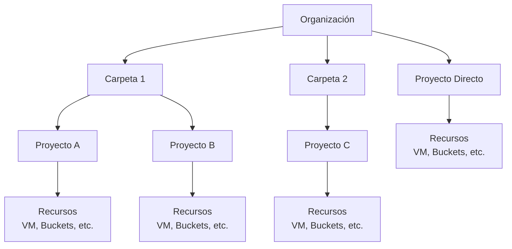
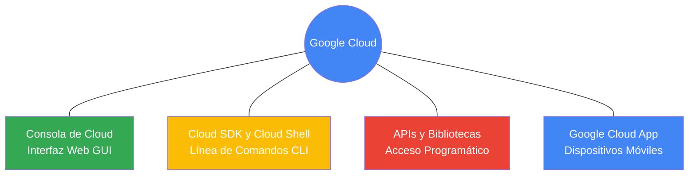

# Google Cloud Platform

GCP es la solución en la nube que ofrece Google, proporcionando una amplia gama de servicios de computación, almacenamiento, análisis de datos y aprendizaje automático sobre la misma infraestructura que utiliza internamente para sus productos finales.

Las ofertas de Google Cloud se clasifican en servicios de procesamiento almacenamiento macrodatos aprendizaje automático y aplicaciones para soluciones de la Web, dispositivos móviles, analítica y backend.

## Conceptos de Cloud

Según el **NIST** (National Institute of Standards and Technology), el Cloud Computing es un modelo que permite el acceso ubicuo, conveniente y bajo demanda a través de la red a un conjunto compartido de recursos de computación configurables (redes, servidores, almacenamiento, aplicaciones y servicios) que pueden ser rápidamente aprovisionados y liberados con un esfuerzo de gestión mínimo o interacción mínima con el proveedor del servicio.

Este modelo se compone de cinco características esenciales (autoservicio bajo demanda, acceso amplio a la red, asignación común de recursos, rapidez y elasticidad, y servicio medido), tres modelos de servicio (SaaS, PaaS, IaaS) y cuatro modelos de despliegue (Privada, Comunitaria, Pública e Híbrida).

### IaaS

**Infrastructure as a Service:** Proporciona recursos informáticos brutos, como servidores, almacenamiento y redes. El usuario es responsable de gestionar el sistema operativo, el middleware y las aplicaciones. Ejemplo en GCP: **Compute Engine**.

### PaaS

**Platform as a Service:** Ofrece un entorno de desarrollo y despliegue en la nube. Google gestiona la infraestructura subyacente (SO, parches, hardware), permitiendo al usuario centrarse solo en el código de su aplicación. Ejemplo en GCP: **App Engine**.

### SaaS

**Software as a Service:** Aplicaciones completas listas para usar que se entregan a través de la web. El proveedor gestiona todo, desde la infraestructura hasta los datos de la aplicación. Ejemplos en el ecosistema de Google: **Google Workspace** (Gmail, Drive).

## La red de Google Cloud

> [!TIP]
> Google Cloud se ejecuta en la red global de Google.
> Es la red más grande de su tipo, diseñada para ofrecer máxima capacidad de procesamiento y latencia mínima mediante:
>
> - **+100 nodos de almacenamiento perimetral:** Ubicaciones de caché para respuestas rápidas.
> - **Infraestructura submarina:** Cables de alto ancho de banda que conectan regiones globalmente.

## Infraestructura Global

La ubicación de los recursos es crítica para la **disponibilidad, durabilidad y latencia** (tiempo de viaje de los datos). Se organiza en:

### 1. Ubicaciones Geográficas

Google Cloud opera en 5 áreas principales: Norteamérica, Sudamérica, Europa, Asia y Australia.

### 2. Regiones y Zonas

- **Región:** Área geográfica independiente (ej. `europe-west2` en Londres).
- **Zona:** Área de implementación dentro de una región. Proporcionan redundancia física. Si una zona falla, los recursos en otras zonas de la misma región pueden seguir operativos.

### 3. Multirregión

Servicios como **Cloud Spanner** o **Cloud Storage** permiten replicar datos en múltiples regiones.

- **Ventaja:** Alta disponibilidad ante desastres naturales que afecten a una región completa y baja latencia de lectura global.

> [!NOTE]
> Actualmente, GCP cuenta con **40 regiones y 121 zonas**, cifras que crecen constantemente. Puedes consultar el estado actual en [cloud.google.com/about/locations](https://cloud.google.com/about/locations).

Puedes encontrar las cifras más actualizadas en [Red de Google Cloud](cloud.google.com/about/locations).

---

## Google y el medio ambiente

Google Cloud se compromete con la sostenibilidad, optimizando su infraestructura física para reducir el impacto ambiental de sus centros de datos, los cuales consumen una parte significativa de la electricidad mundial.

### Hitos y Objetivos:

- **Eficiencia Energética:** Sus centros de datos fueron los primeros en obtener la certificación **ISO 14001**, destacando proyectos como el de Hamina (Finlandia), que utiliza agua de mar para su enfriamiento.
- **Neutralidad de Carbono:** Google fue la primera gran empresa en alcanzar la emisión neutra de carbono.
- **Energía Renovable:** Logró operar con el 100% de energía renovable en su segunda década.
- **Meta 2030:** El objetivo es ser la primera empresa en operar totalmente **sin emisiones de carbono** para el año 2030.

Al ejecutar cargas de trabajo en GCP, los clientes aprovechan una de las nubes más limpias de la industria, alineándose con sus propios objetivos medioambientales.

---

## Seguridad por diseño

Google protege los datos de sus clientes mediante una infraestructura de seguridad construida en capas progresivas:

1. **Hardware:** Google diseña sus propias placas, equipos de red y chips de seguridad personalizados. Utiliza una **pila de arranque seguro** (firmas criptográficas) y centros de datos con acceso físico estrictamente limitado.
2. **Implementación de servicios:** Las comunicaciones entre servicios (RPC) se encriptan automáticamente y cuentan con integridad criptográfica.
3. **Identidad de usuarios:** El servicio de identidad central utiliza análisis de riesgo inteligente y soporta segundos factores de autenticación física (U2F).
4. **Almacenamiento:** Los datos se encriptan por defecto **en reposo** mediante claves administradas centralmente y encriptación a nivel de hardware en discos.
5. **Comunicaciones en Internet:** El **Google Front End (GFE)** gestiona las conexiones TLS siguiendo las mejores prácticas y proporciona una defensa robusta contra ataques de denegación de servicio (**DoS**) gracias a la escala global de su red.
6. **Seguridad Operativa:**
   - Detección de intrusiones mediante IA y ejercicios de _Red Team_.
   - Reducción de riesgos internos mediante el uso obligatorio de llaves de seguridad para empleados.
   - Prácticas de desarrollo seguro con revisión de código por pares y un programa de recompensas por vulnerabilidades (_Bug Bounty_).

> [!IMPORTANT]
> Este enfoque integral garantiza que la seguridad no sea un añadido, sino un componente fundamental de la infraestructura desde su origen.

---

## Precios y Facturación

Google Cloud ofrece un modelo de precios flexible y transparente diseñado para optimizar el gasto según el uso real.

### 1. Modelos de Cobro

- **Facturación por segundo:** Aplicada en servicios como Compute Engine, GKE, Dataproc y el entorno flexible de App Engine.
- **Descuentos por uso continuo:** Compute Engine aplica descuentos automáticos si una instancia se ejecuta por más del 25% del mes.
- **Tipos de VM personalizados:** Permiten ajustar CPU y memoria para pagar solo por los recursos necesarios.

### 2. Control de Gastos

- **Calculadora de precios:** Herramienta en línea ([cloud.google.com/products/calculator](https://cloud.google.com/products/calculator)) para estimar costos antes de desplegar.
- **Presupuestos y Alertas:** Se pueden definir límites fijos o porcentuales a nivel de cuenta o proyecto, configurando alertas (ej. al 50%, 90% o 100%) para evitar sorpresas en la factura.
- **Informes:** Herramientas visuales en la consola para supervisar el gasto detallado por servicio.

### 3. Cuotas de Seguridad

Las cuotas protegen al usuario de consumos excesivos por error o ataques. Se aplican a nivel de proyecto y existen dos tipos:

| Tipo de Cuota     | Descripción                               | Ejemplo                                         |
| :---------------- | :---------------------------------------- | :---------------------------------------------- |
| **De frecuencia** | Se restablecen tras un periodo de tiempo. | Límite de llamadas a una API cada 100 segundos. |
| **De asignación** | Limitan la cantidad total de recursos.    | Número máximo de redes VPC por proyecto.        |

> [!TIP]
> Si necesitas superar un límite predeterminado, puedes solicitar un aumento de cuota al equipo de Asistencia de Google Cloud.

---

## Jerarquía de Recursos

La jerarquía de recursos en Google Cloud consta de cuatro niveles ascendentes: recursos, proyectos, carpetas y el nodo de organización. Esta estructura es fundamental para la administración de políticas y permisos, ya que las políticas se heredan de forma descendente.

### Diagrama de Jerarquía

### Niveles de la Jerarquía

1. **Recursos**: Nivel inferior. Incluyen máquinas virtuales (Compute Engine), buckets de Cloud Storage, tablas en BigQuery, etc. Cada recurso pertenece únicamente a un proyecto.

2. **Proyectos**: Base para habilitar y usar servicios de Google Cloud. Permiten administrar APIs, facturación, colaboradores y otros servicios. Cada proyecto es independiente y se factura por separado.
   - **Atributos de identificación**:
     - **ID del proyecto**: Identificador único global asignado por Google, inmutable.
     - **Nombre del proyecto**: Creado por el usuario, editable y no único.
     - **Número del proyecto**: Asignado por Google para seguimiento interno.

   > [!TIP]
   > El ID del proyecto es único globalmente y no puede cambiarse después de la creación. Se usa para identificar el proyecto en contextos como APIs y comandos de CLI.

3. **Carpetas**: Permiten agrupar proyectos y subcarpetas jerárquicamente. Facilitan la aplicación de políticas y permisos a grupos de recursos. Los recursos heredan políticas de sus carpetas padre.

   > [!TIP]
   > Las políticas aplicadas a una carpeta se heredan por todos los proyectos y recursos dentro de ella, simplificando la administración de permisos.

4. **Nodo de Organización**: Nivel superior que abarca todos los proyectos, carpetas y recursos de una organización. Requiere un dominio de Google Workspace o Cloud Identity.
   - **Roles especiales**:
     - Administrador de políticas de la organización.
     - Creador de proyectos (controla quién puede crear proyectos y gastar).

   > [!TIP]
   > Para usar carpetas, es necesario tener un nodo de organización. Las políticas se pueden definir a nivel de organización, carpeta, proyecto o incluso recursos individuales en algunos servicios.

### Gestión de Políticas y Permisos

- Las políticas se aplican en niveles superiores y se heredan descendente.
- Algunos servicios permiten políticas en recursos individuales.
- La herramienta **Resource Manager** permite gestionar proyectos programáticamente (crear, actualizar, borrar, recuperar borrados) vía API REST o RPC.

> [!TIP]
> La herencia descendente de políticas significa que una política en una carpeta afecta a todos los proyectos y recursos subordinados, evitando duplicación y errores en la gestión de permisos.

### Interacción con Google Cloud

Existen cuatro formas principales de acceder, administrar e interactuar con los recursos de Google Cloud, cada una diseñada para un caso de uso específico o perfil de usuario.

#### 1. Consola de Cloud (Cloud Console)

Es la Interfaz Gráfica de Usuario (GUI) basada en web. Es ideal para buscar recursos con facilidad, verificar el estado de los servicios, gestionar la facturación y presupuestos de forma visual, y conectarse a las instancias mediante SSH directamente desde el navegador.

#### 2. Cloud SDK y Cloud Shell

Orientado a la automatización y administradores de sistemas que prefieren la terminal:

- **Cloud SDK:** Un conjunto de herramientas instalables localmente que incluye `gcloud` (interfaz de línea de comandos principal) y `bq` (para interactuar con BigQuery).
- **Cloud Shell:** Un entorno de línea de comandos al que se accede desde el navegador. Es una máquina virtual basada en Debian que proporciona un **directorio principal (`$HOME`) persistente de 5 GB**. Las herramientas del SDK siempre están instaladas, actualizadas y completamente autenticadas.

> [!TIP]
> **Tip para el examen:** Cloud Shell es una respuesta clave en el examen cuando se requiere un entorno de desarrollo o administración rápido, seguro, sin necesidad de instalaciones locales en la computadora del usuario. Recuerda siempre la característica del **disco persistente de 5 GB**.

#### 3. APIs (Interfaces de Programación de Aplicaciones)

Permiten que tu código interactúe programáticamente con los servicios en la nube.

- **Explorador de APIs de Google:** Una herramienta interactiva en la web que permite descubrir y probar llamadas a las APIs (incluso aquellas que requieren autenticación) antes de escribir el código.
- **Bibliotecas Cliente (Client Libraries):** Google provee bibliotecas oficiales en lenguajes como Java, Python, Node.js, Go, etc., para facilitar la implementación.

> [!TIP]
> **Tip para el examen:** Si un escenario menciona desarrollar una aplicación personalizada que necesita interactuar con servicios de GCP (ej. subir archivos a Cloud Storage o leer de BigQuery), la mejor práctica recomendada siempre es utilizar las **Google Cloud Client Libraries** en lugar de programar llamadas HTTP/REST desde cero.

#### 4. Aplicación de Google Cloud (Mobile App)

Diseñada para monitoreo y administración sobre la marcha. Te permite:

- Iniciar, detener y conectarse por SSH a instancias de Compute Engine o Cloud SQL.
- Administrar despliegues de App Engine, revisar errores o cambiar divisiones de tráfico.
- Configurar gráficos de métricas (uso de red, CPU, errores).
- Responder a incidentes y revisar alertas de presupuesto de facturación en tiempo real.
