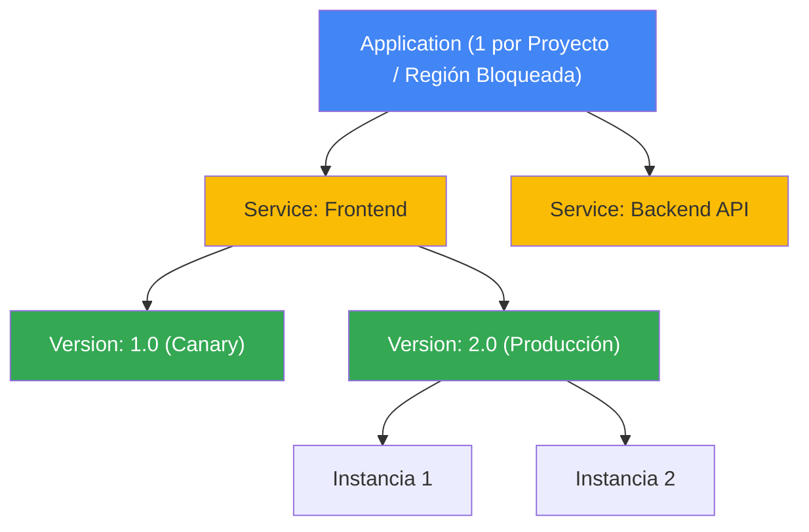

# App Engine

Google App Engine (GAE) es una plataforma como servicio (**PaaS**) y un entorno de ejecución **serverless** diseñado para alojar y escalar aplicaciones web y servicios backend sin preocuparse por la gestión de servidores, parches del sistema operativo o balanceadores de carga.

---

## Estructura Jerárquica de App Engine

App Engine se organiza bajo un modelo jerárquico estricto:

- **Application (Aplicación):** Es el nivel superior. Solo puede haber **una aplicación de App Engine por proyecto de GCP**, y su **región geográfica queda bloqueada permanentemente** una vez que se crea (no se puede cambiar sin crear un proyecto de GCP nuevo).
- **Service (Servicios):** Antes llamados *módulos*. Representan componentes de tu aplicación (ej. frontend, API backend, procesamiento en lote). Cada servicio puede tener su propia configuración de escalado.
- **Version (Versiones):** Cada vez que despliegas código, creas una versión de ese servicio. Esto te permite tener múltiples versiones activas de forma simultánea.
- **Instance (Instancias):** Son los contenedores de ejecución reales que se aprovisionan para procesar las solicitudes entrantes de los usuarios.

---

## Comparativa: Entorno Estándar vs. Entorno Flexible

Esta es una de las preguntas fundamentales en los exámenes de certificación. La elección depende del nivel de control y del comportamiento de escalado requerido:

| Característica | Entorno Estándar (Standard) | Entorno Flexible (Flexible) |
| :--- | :--- | :--- |
| **Tecnología subyacente** | Contenedores sandbox propietarios de Google. | Contenedores Docker ejecutados en VMs de Compute Engine administradas. |
| **Tiempo de inicio** | **Segundos** (arranque casi instantáneo). | **Minutos** (por el aprovisionamiento de VMs). |
| **Escalar a Cero (Scale to Zero)** | **Sí** (si no hay tráfico, las instancias bajan a 0 y el costo es $0). | **No** (mínimo debe haber 1 instancia corriendo por servicio; costo base mínimo). |
| **Límites de escritura** | Solo escritura temporal en `/tmp`. | Escritura local permitida en el disco de la VM. |
| **Acceso a red y puertos** | Restringido (salida a través de APIs de GCP). | Acceso completo a red y puertos personalizados de la VM. |
| **Acceso SSH** | No disponible. | **Sí disponible** (puedes ingresar a las VMs de backend para debuggear). |
| **Runtimes (Lenguajes)** | Solo versiones de lenguajes soportados oficialmente (Java, Python, Node.js, Go, PHP, Ruby). | **Cualquier lenguaje** mediante el uso de un `Dockerfile` personalizado. |

---

## División de Tráfico (Traffic Splitting)

App Engine permite distribuir el tráfico entrante de manera controlada entre diferentes **Versiones** de un mismo servicio sin alterar configuraciones de DNS. Es muy utilizado para despliegues tipo Canary y pruebas A/B.

El tráfico se puede dividir bajo tres métodos:
1. **Por Dirección IP:** Deriva al mismo usuario a la misma versión según su IP de origen (útil para consistencia).
2. **Por Cookie:** Utiliza una cookie HTTP en el navegador del usuario para asegurar que siga viendo la misma versión en visitas repetidas (más preciso que IP).
3. **Aleatorio:** Distribuye las solicitudes al azar según el porcentaje asignado.

---

## Datos Clave

- **Región Inmutable:** Una vez que habilitas App Engine en un proyecto y seleccionas la región, **nunca se puede cambiar**. Para cambiarla, debes crear un proyecto de GCP completamente nuevo.
- **Límite por Proyecto:** Solo se permite **una aplicación de App Engine por proyecto**.
- **Scale to Zero:** Recuerda que solo el **Entorno Estándar** puede escalar a cero instancias para ahorrar costos al 100% cuando no hay tráfico.
- **Cron Jobs integrados:** App Engine cuenta con un programador de tareas (`cron.yaml`) nativo para ejecutar funciones de forma periódica de manera muy simple.
