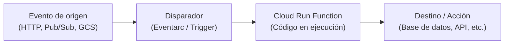

# Cloud Run Functions (antes Cloud Functions)

Cloud Run functions (2nd gen) es la solución de funciones como servicio (**FaaS**) de Google Cloud. Permite ejecutar pequeños fragmentos de código (funciones) en respuesta a eventos, de forma totalmente serverless y sin necesidad de gestionar servidores o entornos de contenedores manualmente.

## Características principales

- **FaaS (Function as a Service)**: Despliega directamente tu código (Node.js, Python, Go, Java, .NET, Ruby, PHP) sin tener que empaquetarlo en un contenedor Docker de manera explícita (Cloud Build lo hace internamente).
- **Basado en eventos (Event-driven)**: Ejecución automática en respuesta a disparadores (triggers) como solicitudes HTTP, mensajes en Cloud Pub/Sub, cambios en Cloud Storage o eventos de Eventarc.
- **Escalabilidad automática**: Escala desde cero instancias hasta miles según la demanda.
- **Arquitectura de 2.ª generación**: Construido sobre Cloud Run y Eventarc, lo que permite tiempos de procesamiento más largos (hasta 60 minutos para HTTP), mayor tamaño de instancias y concurrencia.

## Casos de uso típicos

- **Procesamiento de archivos**: Redimensionar imágenes o analizar archivos de texto inmediatamente al subirse a Cloud Storage.
- **Webhooks e integraciones**: Procesar payloads de servicios externos (GitHub, Stripe, etc.).
- **Procesamiento de datos en tiempo real**: Filtrar y transformar mensajes de Pub/Sub antes de guardarlos en BigQuery.
- **Automatización de IT**: Tareas programadas de mantenimiento y limpieza en la nube.

## Flujo de trabajo

## Enlaces útiles

- [Documentación oficial de Cloud Run functions](https://cloud.google.com/functions/docs)
- [Guía de inicio rápido de Cloud Run functions](https://cloud.google.com/functions/docs/writing)

## Datos Clave

- **FaaS Serverless**: Ejecuta código directamente en respuesta a eventos sin aprovisionar infraestructura.
- **Basado en Cloud Run**: La segunda generación de funciones corre internamente sobre Cloud Run.
- **Eventos**: Altamente integrado con Eventarc para capturar eventos de más de 90 servicios de Google Cloud y fuentes externas.
- **Escala a cero**: No genera costos cuando la función no está activa o no recibe eventos.
- **Tiempo máximo de ejecución**:
  - **1.ª generación**: 9 minutos (540 segundos).
  - **2.ª generación**: 60 minutos para solicitudes HTTP y 10 minutos para funciones basadas en eventos (event-driven).
