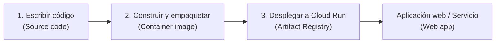

# Cloud Run

Google Cloud Run es un servicio **serverless** que permite ejecutar contenedores **sin gestionar infraestructura**. Proporciona un entorno gestionado donde la plataforma se encarga del aprovisionamiento, escala y mantenimiento de los recursos.

## Características principales

- **Ejecución sin servidor**: No necesitas crear o administrar máquinas virtuales.
- **Escalado automático**: Escala a cero cuando no hay tráfico y a miles de instancias bajo alta carga.
- **Coste Cero en Inactividad**: Permite configurar el parámetro de instancias mínimas en cero (`min-instances = 0`). Si no hay demanda o peticiones entrantes, el servicio apaga todos los contenedores activos, reduciendo el coste de cómputo a literalmente $0.
- **Compatibilidad con contenedores**: Cualquier contenedor Docker puede desplegarse.
- **Integración con Cloud Build y Artifact Registry**: Flujos CI/CD simplificados.
- **Gestión de tráfico**: Deploys de versiones y splitting de tráfico entre versiones.
- **Seguridad**: Integración con IAM y Cloud Run Auth para control de acceso.

## Casos de uso típicos

- APIs y microservicios.
- Aplicaciones web estáticas que requieren backend o arquitecturas orientadas a picos masivos de tráfico imprevisto (ej. notificaciones push).
- Procesamiento de eventos (por ejemplo, Cloud Pub/Sub → Cloud Run).
- Tareas de corta o mediana duración sin estado que se resuelvan dentro de los límites de tiempo orientados a entornos web.

## Flujo de trabajo

## Enlaces útiles

- [Documentación oficial de Cloud Run](https://cloud.google.com/run/docs)
- [Guía de inicio rápido con Cloud Build y Artifact Registry](https://cloud.google.com/run/docs/quickstarts/build-and-deploy)
- [Ejemplos de despliegue en GitHub](https://github.com/GoogleCloudPlatform/cloud-run-samples)

## Datos Clave

- **Serverless**: Cloud Run es un servicio serverless que ejecuta contenedores sin gestionar infraestructura.

- **Contenedores sin estado**: Ideal para contenedores sin estado que pueden escalar rápidamente.

- **Eventos web o Pub/Sub**: Soporta disparar contenedores principalmente mediante solicitudes HTTP, mensajes de Pub/Sub o eventos de Eventarc.

- **Precisión de facturación**: Se cobra por los recursos usados con una precisión de 100 ms mientras el contenedor procesa activamente una solicitud.

- **Tiempo Límite de Ejecución**: El tiempo máximo de procesamiento por cada petición HTTP en Cloud Run estándar es de hasta 60 minutos. Tareas en segundo plano que requieran más tiempo o no utilicen HTTP (como hilos de procesamiento TCP puro o gRPC persistente que duren horas) deben ser delegadas a GKE o Compute Engine.

