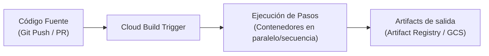

# Cloud Build

Google Cloud Build es un servicio de integración y entrega continuas (**CI/CD**) completamente gestionado y serverless. Permite compilar, probar y desplegar software de forma rápida y a gran escala en la infraestructura de Google Cloud.

## Características principales

- **Ejecución serverless**: No es necesario aprovisionar ni gestionar servidores de compilación. Escala automáticamente bajo demanda.
- **Configuración declarativa**: Los flujos de compilación se definen mediante un archivo de configuración (`cloudbuild.yaml` o `cloudbuild.json`).
- **Pasos de compilación basados en contenedores**: Cada paso en una compilación se ejecuta como un contenedor Docker independiente.
- **Triggers (Disparadores)**: Automatización de ejecuciones al detectar cambios en repositorios de código fuente (GitHub, GitLab, Bitbucket, Cloud Source Repositories).
- **Seguridad y secretos**: Integración con IAM para control de permisos y Secret Manager para manejar credenciales de forma segura.

## Archivo de configuración típico (`cloudbuild.yaml`)

```yaml
steps:
  # Paso 1: Construir la imagen del contenedor
  - name: 'gcr.io/cloud-builders/docker'
    args: ['build', '-t', 'us-central1-docker.pkg.dev/$PROJECT_ID/my-repo/my-image:latest', '.']
  
  # Paso 2: Subir la imagen a Artifact Registry
  - name: 'gcr.io/cloud-builders/docker'
    args: ['push', 'us-central1-docker.pkg.dev/$PROJECT_ID/my-repo/my-image:latest']

images:
  - 'us-central1-docker.pkg.dev/$PROJECT_ID/my-repo/my-image:latest'
```

## Flujo de trabajo



## Enlaces útiles

- [Documentación oficial de Cloud Build](https://cloud.google.com/build/docs)
- [Guía sobre cómo crear archivos cloudbuild.yaml](https://cloud.google.com/build/docs/configuring-builds/create-basic-configuration)

## Datos Clave

- **CI/CD Serverless**: Ejecuta flujos de integración y entrega continuas sin gestionar servidores de build.
- **Basado en Contenedores**: Cada paso del pipeline (`step`) se ejecuta dentro de un contenedor Docker específico.
- **YAML de configuración**: Toda la lógica del pipeline se declara en un archivo `cloudbuild.yaml`.
- **Integración nativa**: Se conecta perfectamente con Artifact Registry para almacenar imágenes y con GKE/Cloud Run para despliegues automáticos.
