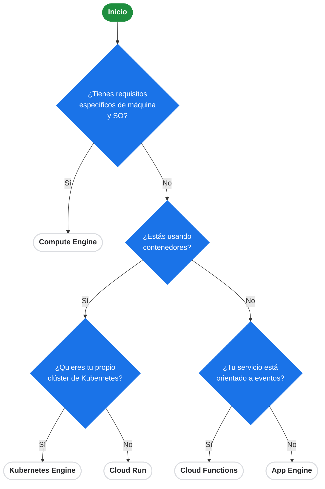

# Seleccionando una plataforma de despliegue en Google Cloud

El siguiente diagrama ayuda a decidir qué servicio de cómputo de Google Cloud Platform (GCP) se adapta mejor a las necesidades de tu aplicación o carga de trabajo.

## Resumen de las opciones:

1. **Compute Engine**: Infraestructura como Servicio (IaaS). Ideal cuando necesitas control total sobre las máquinas virtuales (VMs), sistemas operativos y configuraciones específicas de red o hardware.
2. **Kubernetes Engine (GKE)**: Contenedores como Servicio (CaaS). La mejor opción si utilizas contenedores y requieres un control detallado sobre la orquestación, el clúster, escalado y gestión compleja de microservicios.
3. **Cloud Run**: Plataforma sin servidor (Serverless) para contenedores. Ideal para desplegar contenedores rápidamente sin preocuparse por la infraestructura subyacente. Escala a cero y pagas solo por el uso.
4. **Cloud Functions**: Función como Servicio (FaaS). Perfecto para código orientado a eventos (ej. procesamiento de archivos en Cloud Storage, respuestas a mensajes de Pub/Sub) sin preocuparse por el entorno ni infraestructura.
5. **App Engine**: Plataforma como Servicio (PaaS). Ideal para aplicaciones web y APIs donde quieres enfocarte únicamente en el código, permitiendo que Google gestione el despliegue, escalado y administración del entorno.
