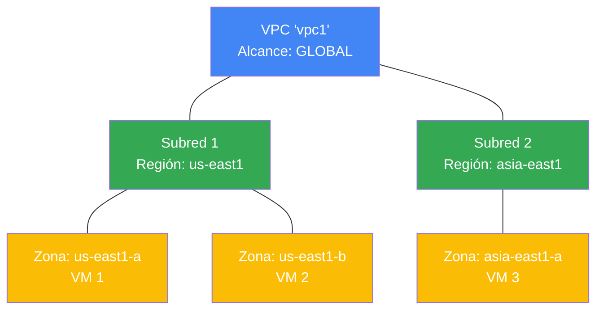

# Redes en Google Cloud

En Google Cloud, la base para conectar los recursos, tanto entre sí como con Internet, es la red virtual. Las redes permiten segmentar el tráfico, aplicar reglas de firewall para restringir accesos y crear rutas estáticas para dirigir la información a destinos específicos.

## Virtual Private Cloud (VPC)

Una **Nube Privada Virtual (VPC)** es un modelo privado, individual y seguro de computación en la nube alojado dentro de una nube pública. Las VPC combinan la escalabilidad y conveniencia de la nube pública con el aislamiento de datos característico de una red privada (On-Premise).

Es en las VPC donde se ejecutan y comunican recursos como las máquinas virtuales (VMs) de Compute Engine o los clústeres de Kubernetes (GKE).

### Características Clave de las VPC y Subredes

A diferencia de otros proveedores de nube, la arquitectura de red en Google Cloud tiene una estructura particular que la hace única y muy flexible:

- **Las redes VPC son Globales:** Una sola red VPC puede abarcar múltiples regiones en todo el mundo de forma nativa.
- **Las Subredes son Regionales:** Una VPC se puede dividir en subredes. Cada subred pertenece a una **región** específica, pero abarca **todas las zonas** dentro de esa región.
- **Expansión Dinámica de IP:** Puedes ampliar el tamaño de una subred (incrementar el rango de direcciones IP) en cualquier momento. Esto no afecta en absoluto a las máquinas virtuales que ya están configuradas y funcionando.

### Diagrama de Arquitectura

> [!TIP]
> **Tip de Arquitectura para el Examen:**
> ¡Recuerda siempre esta regla de oro: **VPC = Global, Subred = Regional**! Múltiples VMs pueden compartir exactamente la misma subred aunque se encuentren en diferentes zonas (ej. zona `A` y zona `B`), lo que facilita enormemente el diseño de arquitecturas de Alta Disponibilidad (HA) sin complicar el diseño de red.

---

## Datos Clave y Límites (Quotas)

- **Límite de Redes VPC:** Por defecto, Google Cloud permite un máximo de **15 redes VPC por proyecto**. Si tu diseño requiere más, debes solicitar un incremento de cuota.
- **Subred requerida:** Una red VPC debe tener al menos una subred creada para poder asociarle recursos (como instancias de VM) y utilizarla.
- **Modos de creación (Auto vs Custom):** Las redes de modo automático crean una subred por región por defecto, mientras que las redes de **modo personalizado (Custom Mode) comienzan sin ninguna subred**, requiriendo que las crees manualmente antes de poder desplegar recursos.
- **Sin Broadcast ni Multicast nativo:** La red de Google Cloud solo soporta tráfico **Unicast**. No es posible enviar tráfico de tipo broadcast o multicast tradicional directamente.
- **La red por defecto ("default"):** Cada nuevo proyecto se crea con una red VPC predeterminada con subredes automáticas en cada región y reglas de firewall que permiten el tráfico de entrada SSH y RDP. Por seguridad, la mejor práctica en entornos de producción es **eliminar la red default** y configurar redes personalizadas (Custom Mode).

