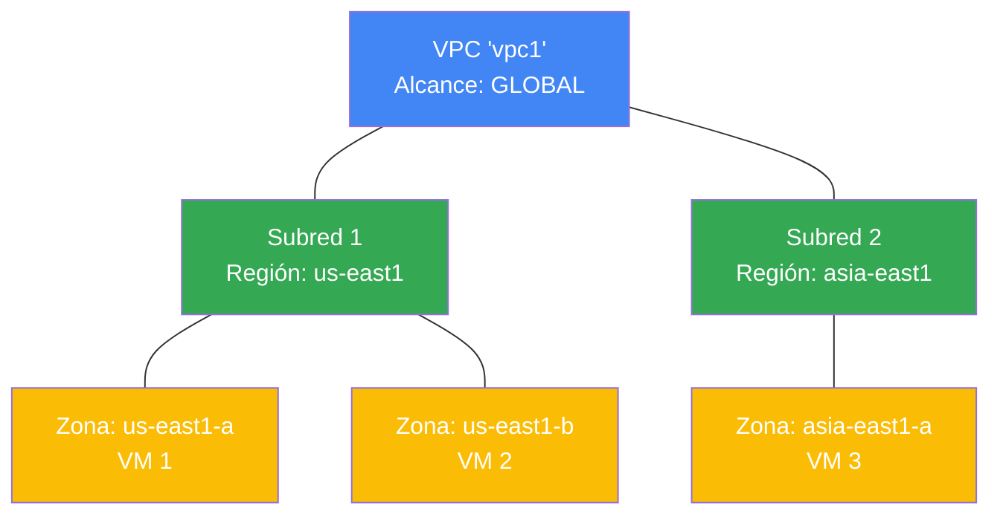

# Redes en Google Cloud

En Google Cloud, la base para conectar los recursos, tanto entre sí como con Internet, es la red virtual. Las redes permiten segmentar el tráfico, aplicar reglas de firewall para restringir accesos y crear rutas estáticas para dirigir la información a destinos específicos.

## Virtual Private Cloud (VPC)

Una **Nube Privada Virtual (VPC)** es un modelo privado, individual y seguro de computación en la nube alojado dentro de una nube pública. Las VPC combinan la escalabilidad y conveniencia de la nube pública con el aislamiento de datos característico de una red privada (On-Premise).

Es en las VPC donde se ejecutan y comunican recursos como las máquinas virtuales (VMs) de Compute Engine o los clústeres de Kubernetes (GKE).

### Características Clave de las VPC y Subredes

A diferencia de otros proveedores de nube, la arquitectura de red en Google Cloud tiene una estructura particular que la hace única y muy flexible:

- **Las redes VPC son Globales:** Una sola red VPC puede abarcar múltiples regiones en todo el mundo de forma nativa.
- **Las Subredes son Regionales:** Una VPC se puede dividir en subredes. Cada subred pertenece a una **región** específica, pero abarca **todas las zonas** dentro de esa región.
- **Expansión Dinámica de IP:** Puedes ampliar el tamaño de una subred (incrementar el rango de direcciones IP) en cualquier momento. Esto no afecta en absoluto a las máquinas virtuales que ya están configuradas y funcionando.

### Diagrama de Arquitectura

> [!TIP]
> **Tip de Arquitectura para el Examen:**
> ¡Recuerda siempre esta regla de oro: **VPC = Global, Subred = Regional**! Múltiples VMs pueden compartir exactamente la misma subred aunque se encuentren en diferentes zonas (ej. zona `A` y zona `B`), lo que facilita enormemente el diseño de arquitecturas de Alta Disponibilidad (HA) sin complicar el diseño de red.

## Rutas y Tabla de Enrutamiento (Routing)

Cada red VPC en Google Cloud tiene una **tabla de enrutamiento** asociada que le dice a las instancias de VM hacia dónde enviar el tráfico según la dirección IP de destino. Las rutas se dividen en tres tipos principales:

### 1. Rutas generadas por el sistema (System-Generated)
Se crean de forma automática y no se pueden modificar manualmente:
- **Ruta por defecto (Default Route - `0.0.0.0/0`):** Envía el tráfico destinado a Internet a través de la puerta de enlace de Internet de Google Cloud (Internet Gateway).
- **Rutas de subred (Subnet Routes):** Google crea automáticamente una ruta para cada subred que agregues a la VPC. Esto permite que **todas las subredes de una misma VPC se comuniquen de forma nativa e interna**, incluso si se encuentran en diferentes regiones del mundo (sin necesidad de VPN o configuraciones adicionales), siempre que el firewall lo permita.

### 2. Rutas Estáticas (Static Routes)
Creadas manualmente por el administrador para desviar tráfico específico.
- **Caso de uso típico:** Dirigir tráfico hacia una máquina virtual específica que actúa como un firewall de red virtual (Virtual Appliance) o hacia una puerta de enlace de VPN no administrada.

### 3. Rutas Dinámicas (Dynamic Routes)
Son administradas de manera automática mediante el protocolo BGP (Border Gateway Protocol) a través de **Cloud Router**. Se utilizan para conectar tu VPC con redes externas (como tu centro de datos local / On-Premise) a través de Cloud VPN o Cloud Interconnect.

---

### Modo de Enrutamiento Dinámico (Dynamic Routing Mode)
A nivel de la VPC, puedes configurar cómo se comportan estas rutas dinámicas:
- **Regional (por defecto):** Cloud Router solo aprende y comparte rutas dinámicas para los recursos ubicados en su propia región.
- **Global:** Cloud Router puede compartir y aplicar rutas dinámicas para todos los recursos de la VPC a nivel global, sin importar en qué región del mundo se encuentren.

---

## Intercambio de Tráfico de Redes VPC (VPC Network Peering)

**VPC Network Peering** permite conectar de forma privada dos redes VPC (ya sea en el mismo proyecto, en proyectos distintos, o incluso en diferentes organizaciones) para que sus recursos se comuniquen mediante direcciones IP internas.

### Características Claves de VPC Peering:
- **No Transitividad (Non-Transitivity):** El peering **no es transitivo**. Si la red `VPC-A` tiene peering con la `VPC-B`, y la `VPC-B` tiene peering con la `VPC-C`, las redes `VPC-A` y `VPC-C` **no pueden comunicarse entre sí** a través de la `VPC-B`. Para conectarlas, debes crear un peering directo entre `VPC-A` y `VPC-C`.
- **Sin Solapamiento de IPs (No Overlapping CIDRs):** Las dos redes VPC que se van a conectar **no deben tener rangos de subredes IP que se solapen**. Si existe una subred con el mismo rango IP en ambas redes, la conexión de peering fallará y no podrá establecerse.
- **Configuración Bidireccional:** El peering debe configurarse en **ambas redes**. Para que la conexión pase a estado `ACTIVE`, el administrador de la `VPC-A` debe apuntar hacia la `VPC-B`, y el administrador de la `VPC-B` debe hacer lo mismo hacia la `VPC-A`.
- **Rendimiento de Red Nativo:** El tráfico de peering no pasa por la Internet pública ni por gateways intermedios. Se mantiene dentro de la red interna de Google, lo que garantiza el mismo ancho de banda y latencia mínima que si estuvieran en la misma red.

---

## VPC Compartida (Shared VPC) vs. VPC Peering

Google Cloud ofrece dos métodos principales para conectar proyectos y recursos de red, cada uno con enfoques de administración y control diferentes:

### 1. VPC Compartida (Shared VPC)
Permite centralizar la administración de la red en un solo proyecto, manteniendo los recursos de cómputo en proyectos separados.
- **Estructura:** Consiste en un **Proyecto Host (Host Project)** que contiene la red VPC física, y uno o más **Proyectos de Servicio (Service Projects)** que se conectan a él.
- **Control Centralizado:** El equipo de red administra la VPC, subredes, firewalls y rutas en el Proyecto Host. Los desarrolladores de los Proyectos de Servicio pueden desplegar sus recursos (como VMs) en las subredes compartidas, pero no tienen permisos para alterar la infraestructura de red.
- **Alcance:** Solo se puede configurar entre proyectos que pertenecen a la **misma organización** de Google Cloud.

### 2. VPC Peering (Intercambio de Tráfico)
Permite conectar de manera descentralizada redes VPC físicamente separadas.
- **Estructura:** Conecta **dos redes VPC independientes** que pueden residir en diferentes proyectos.
- **Control Descentralizado:** Cada red mantiene su propio administrador de red, sus propias políticas de firewall, subredes y tablas de enrutamiento.
- **Alcance:** Permite conectar redes VPC de proyectos que pertenecen a **diferentes organizaciones** de Google Cloud.

### Tabla Comparativa de Examen:

| Característica | VPC Compartida (Shared VPC) | Intercambio de Tráfico (VPC Peering) |
| :--- | :--- | :--- |
| **Número de redes VPC** | **1 sola red** (compartida por el Proyecto Host). | **2 redes distintas** (conectadas por un enlace). |
| **Administración** | **Centralizada** (un equipo controla toda la red). | **Descentralizada** (cada red se administra por separado). |
| **Relación de Proyectos** | Proyecto Host ➔ Proyectos de Servicio. | Proyecto A ➔ Proyecto B (pares independientes). |
| **Límite Organizacional** | Obligatorio estar en la **misma organización**. | Puede cruzar **diferentes organizaciones**. |
| **Solapamiento de IPs** | Imposible (es la misma red física). | No permitido (el enlace falla si hay colisión de CIDRs). |

---

## Datos Clave y Límites (Quotas)

- **Límite de Redes VPC:** Por defecto, Google Cloud permite un máximo de **15 redes VPC por proyecto**. Si tu diseño requiere más, debes solicitar un incremento de cuota.
- **Subred requerida:** Una red VPC debe tener al menos una subred creada para poder asociarle recursos (como instancias de VM) y utilizarla.
- **Modos de creación (Auto vs Custom):** Las redes de modo automático crean una subred por región por defecto, mientras que las redes de **modo personalizado (Custom Mode) comienzan sin ninguna subred**, requiriendo que las crees manualmente antes de poder desplegar recursos.
- **Sin Broadcast ni Multicast nativo:** La red de Google Cloud solo soporta tráfico **Unicast**. No es posible enviar tráfico de tipo broadcast o multicast tradicional directamente.
- **La red por defecto ("default"):** Cada nuevo proyecto se crea con una red VPC predeterminada con subredes automáticas en cada región y reglas de firewall que permiten el tráfico de entrada SSH y RDP. Por seguridad, la mejor práctica en entornos de producción es **eliminar la red default** y configurar redes personalizadas (Custom Mode).

