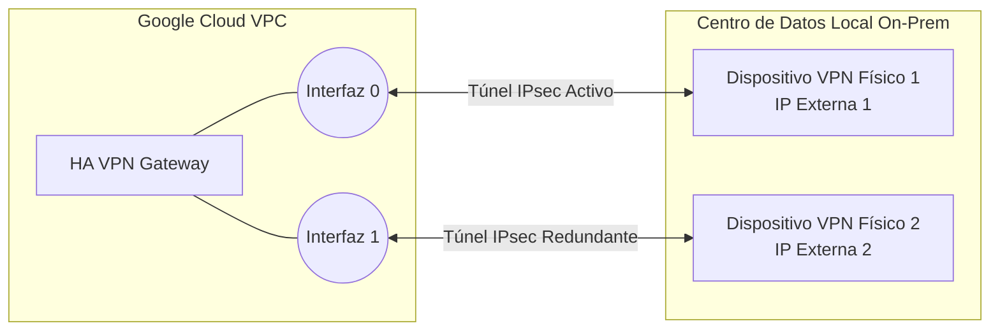
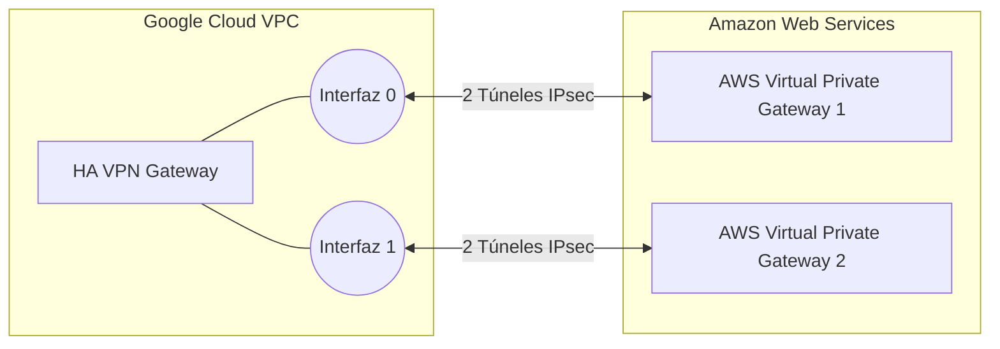
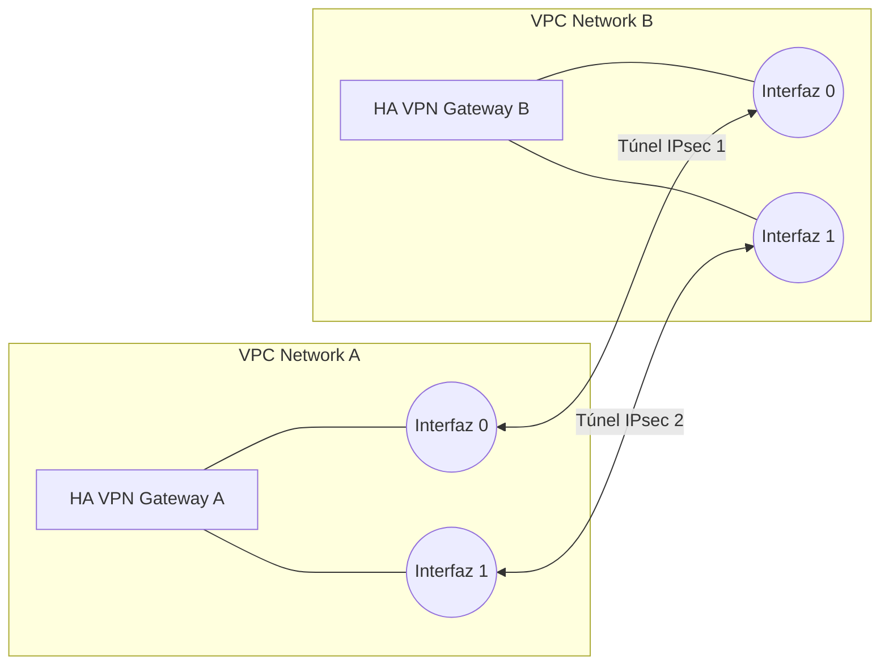
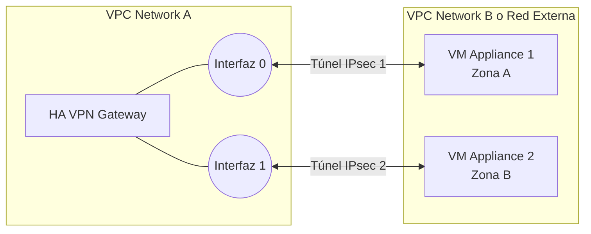

# Topologías de HA VPN

Google Cloud HA VPN (High Availability VPN) es extremadamente flexible y soporta diversas topologías para conectar redes de manera segura con un SLA del 99.99%. 

Para lograr esta alta disponibilidad, una puerta de enlace (Gateway) de HA VPN siempre se aprovisiona con **dos interfaces independientes**, cada una con su propia IP pública. 

A continuación, se detallan las cuatro topologías principales compatibles:

## 1. HA VPN a On-Premise (Dispositivos VPN Locales)

Esta es la configuración clásica para conectar Google Cloud con tu centro de datos físico (On-Premise). 
Para lograr redundancia en tu lado de la conexión (y alcanzar el 99.99% de SLA), debes conectar la HA VPN de Google a **dos dispositivos de hardware o routers VPN físicos separados** en tu centro de datos. Si un router físico en tu edificio se apaga, el otro sigue funcionando.

## 2. HA VPN hacia AWS (Cross-Cloud VPN)

Si tienes recursos en AWS y deseas conectarlos a GCP sin usar Cross-Cloud Interconnect, puedes establecer túneles VPN IPsec. En AWS puedes conectarte a un *Transit Gateway* o a un *Virtual Private Gateway (VGW)*. 

Para lograr alta disponibilidad con AWS, la topología estándar crea **cuatro túneles** en total: dos túneles desde la primera interfaz hacia un VGW en AWS, y dos túneles desde la segunda interfaz hacia el otro VGW en AWS.

## 3. HA VPN entre dos redes VPC de Google Cloud

A veces necesitas conectar dos redes VPC distintas dentro de Google Cloud de forma encriptada (en lugar de usar VPC Peering, que no encripta el tráfico a nivel de usuario y anuncia todas las rutas automáticamente).

En este caso, creas un HA VPN Gateway en cada red VPC y emparejas sus interfaces directamente: Interfaz 0 con Interfaz 0, e Interfaz 1 con Interfaz 1.

## 4. HA VPN hacia Máquinas Virtuales (VM Appliances)

En esta topología, en lugar de conectarse a un Gateway administrado, el HA VPN Gateway de Google se conecta a máquinas virtuales (Compute Engine VMs) individuales que han sido configuradas internamente con software de firewall/VPN de terceros (ej. Fortinet, pfSense, Cisco Cloud CSR). 

Para lograr alta disponibilidad, las VMs destino deben estar alojadas en distintas zonas.

---

## Estrategias de Enrutamiento: Activa/Activa vs Activa/Pasiva

Cuando configuras HA VPN con BGP, puedes decidir cómo fluye el tráfico por esos túneles:

*   **Activa / Activa:** El tráfico se divide en partes iguales entre los dos túneles. **Riesgo:** Si el tráfico normal satura más del 50% de la capacidad de ambos túneles juntos, si un túnel falla, todo el tráfico se moverá al túnel sobreviviente y causará lentitud por falta de ancho de banda.
*   **Activa / Pasiva (Recomendada):** Un túnel transporta el 100% del tráfico y el otro se queda inactivo en modo de espera. Esto garantiza una "experiencia de ancho de banda coherente", ya que si el túnel principal cae, el túnel pasivo tiene toda su capacidad intacta para absorber la carga.

---

## HA VPN sobre Cloud Interconnect

Existe un escenario avanzado donde combinas HA VPN y Cloud Interconnect. 
La Dedicated/Partner Interconnect proporciona la conexión física de alta velocidad y **aislada del Internet público**, mientras que la HA VPN se configura "por encima" de esta conexión física para **encriptar** los datos mediante IPsec. 
Para esto, se configuran dos *Cloud Routers* diferentes: uno dedicado a gestionar la interconexión física (adjuntos VLAN) y otro exclusivamente para administrar las sesiones BGP de la VPN.
