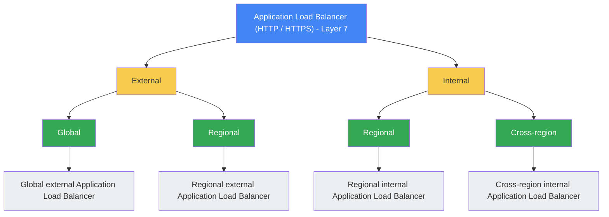
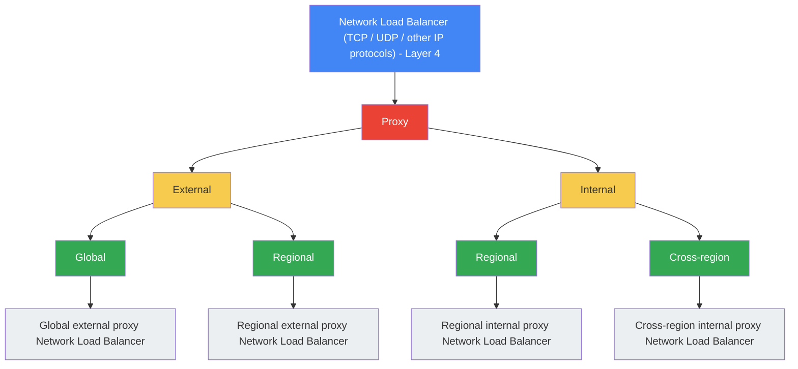
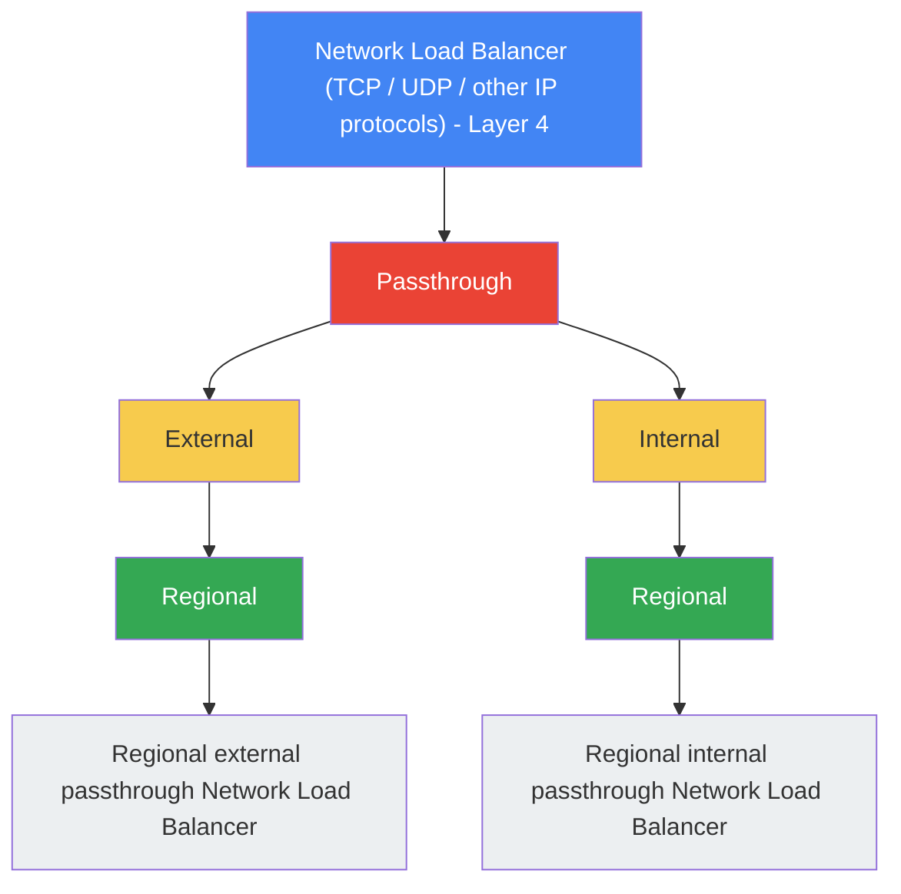

# Cloud Load Balancing

Google Cloud Load Balancing es un servicio de balanceo de cargas totalmente distribuido y administrado por software para todo tu tráfico.

## Características Principales

- **Balanceo de Cargas Multirregional y Failover Automático:** Ofrece balanceo de cargas entre diferentes regiones geográficas usando una **única dirección IP Anycast global**. Si los backends (servidores) de la región más cercana al usuario se encuentran en mal estado (fallan las verificaciones de estado) o se saturan, el balanceador redirige el tráfico automáticamente y en fracciones de segundo hacia la siguiente región más cercana con backends saludables, sin necesidad de cambios en el DNS.

## Tipos de Balanceadores de Aplicación (L7)

Los balanceadores de aplicación operan en la capa 7 (capa de aplicación) del modelo OSI y tienen las siguientes características fundamentales:

- **Funcionan como Proxy Inverso:** Actúan en medio de los clientes y tus servidores, recibiendo la petición del cliente y abriendo una conexión nueva hacia el backend seleccionado.
- **Optimización de Tráfico Web:** Están diseñados específicamente para administrar, inspeccionar y optimizar el tráfico **HTTP y HTTPS**.
- **Flexibilidad de Despliegue:** Se pueden configurar tanto para exponer aplicaciones de forma **externa** (disponibles en Internet mediante IPs públicas) como de forma **interna** (privadas para servicios dentro de la VPC).

La familia de balanceadores de aplicación se clasifica según su alcance y su cobertura geográfica:

## Tipos de Balanceadores de Red (L4)

Los balanceadores de red operan en la capa 4 (capa de transporte) del modelo OSI y distribuyen el tráfico basándose en protocolos de red de transporte (como TCP, UDP u otros protocolos IP), sin inspeccionar el contenido del tráfico web.

### Entendiendo la diferencia: Proxy vs. Passthrough

Para entender la diferencia de forma sencilla, imagina cómo viaja el paquete de red (la conexión TCP) desde el cliente hasta tu servidor (backend):

#### A. Modelo Proxy (Terminación de Conexión)
El balanceador actúa como un **intermediario/traductor**.
1. El cliente inicia una conexión TCP. Esta conexión **termina (se cierra) en el propio balanceador de carga**.
2. El balanceador recibe la petición, la procesa y abre una **segunda conexión TCP nueva** desde él hacia tu máquina virtual de backend.
* **Consecuencia:** La VM de backend no habla directamente con el cliente; ve la dirección IP del balanceador de carga como la IP de origen (a menos que se use el protocolo Proxy para pasar la IP real).
* **Ventajas:** Permite descifrar tráfico SSL (SSL Offloading), inspeccionar o modificar cabeceras, y tomar decisiones inteligentes sobre a dónde enviar el tráfico.

#### B. Modelo Passthrough (Paso Directo / No Terminación)
El balanceador actúa como un **oficial de tránsito / cartero**.
1. El cliente inicia una conexión TCP destinada a la IP del balanceador.
2. El balanceador recibe el paquete, **no lo abre ni lo modifica**, simplemente lo redirige tal cual a la VM de backend más apta.
3. La conexión TCP se establece **directamente entre el cliente y la VM de backend**.
* **Consecuencia:** La VM de backend recibe el paquete con la dirección IP real del cliente y la dirección IP destino original. Es extremadamente rápido.
* **Ventajas:** Latencia ultra baja y rendimiento máximo, ya que el balanceador no gasta recursos procesando o recreando conexiones.

---

### Tabla Comparativa:

| Característica | L4 Proxy | L4 Passthrough (Paso Directo) |
| :--- | :--- | :--- |
| **Conexión TCP** | Se divide en dos (Cliente ➔ Balancer y Balancer ➔ Backend). | Va directa de extremo a extremo (Cliente ➔ Backend). |
| **IP de origen en la VM** | La IP del balanceador (requiere *Proxy Protocol* para ver la del cliente). | La IP pública real del cliente (nativo). |
| **Cifrado SSL / TLS** | Puede terminar el cifrado en el balanceador (SSL Offloading). | No puede descifrar; el tráfico debe llegar cifrado a la VM. |
| **Rendimiento y Latencia** | Latencia ligeramente mayor por el procesamiento del proxy. | Latencia ultra baja y mayor rendimiento. |
| **Alcance** | Puede ser Global o Regional. | Es estrictamente **Regional**. |

---

A continuación se detalla la clasificación de los balanceadores de red que actúan como **Proxy**:

A continuación se detalla la clasificación de los balanceadores de red que actúan como **Passthrough (Paso Directo)**:

## Datos Clave

- **Servicio Administrado y Definido por Software (SDN):** Es un servicio completamente distribuido, definido por software y administrado por Google Cloud. Como no se ejecuta sobre instancias de máquinas virtuales que el usuario deba gestionar, no requiere preocuparse por la administración, el escalado de hardware ni el mantenimiento de los balanceadores; Google escala el servicio de forma automática según la demanda.

