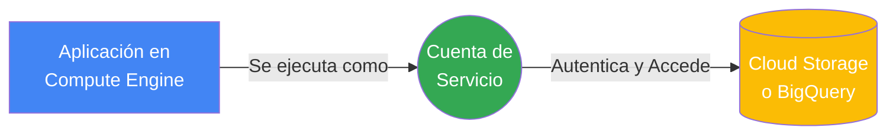
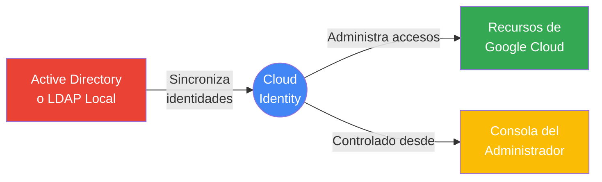

# IAM (Identity and Access Management)

Cuando un nodo de organización tiene muchas carpetas, proyectos y recursos, los administradores pueden usar **Identity and Access Management (IAM)** para restringir el acceso de forma centralizada.

### Principales conceptos de IAM

- **Principal**: El “quién” de la política. Puede ser:
  - Cuenta de Google
  - Grupo de Google
  - Cuenta de servicio
  - Dominio de Cloud Identity
- Cada principal tiene un identificador, normalmente un correo electrónico.
- **Roles**: Definen el “qué puede hacer”. Un rol es una colección de permisos.
- Si otorgas un rol a un principal, le concedes todos los permisos que ese rol contiene.

> [!TIP]
> En IAM, el “quién” se llama principal y el “qué puede hacer” se define con roles. Un usuario o servicio puede recibir permisos agrupados en un rol en lugar de asignar permisos individuales.

### Herencia de políticas en IAM

- Cuando se asigna un rol a un principal en un elemento de la jerarquía (organización, carpeta, proyecto o recurso), la política se aplica también a todos los elementos inferiores.
- Esto permite estructurar permisos de forma eficiente y consistente.
- Las políticas de denegación se aplican antes de las políticas de permisos.
- Las políticas de denegación también se heredan por la jerarquía de recursos.

> [!TIP]
> IAM siempre evalúa primero las denegaciones. Si un principal tiene una denegación relevante, esa denegación prevalece incluso si otro rol le otorga el permiso.

### Tipos de roles en IAM

1. **Roles básicos**
   - Son roles de amplio alcance.
   - Se aplican a todo el proyecto y afectan a todos los recursos del proyecto.
   - Roles básicos comunes:
     - `Owner` (Propietario)
     - `Editor` (Editor)
     - `Viewer` (Visualizador)
     - `Billing Administrator` (Administrador de facturación)

   - **Visualizador:** puede ver recursos, pero no puede modificarlos.
   - **Editor:** puede acceder y modificar recursos.
   - **Propietario:** puede acceder, modificar recursos, administrar roles y permisos, y configurar la facturación.
   - **Administrador de facturación:** controla la facturación sin poder modificar los recursos.

   > [!TIP]
   > Para separación de funciones, utiliza `Billing Administrator` cuando alguien necesite controlar costos sin tener acceso para cambiar recursos.

2. **Roles predefinidos**
   - Son roles específicos de un servicio.
   - Están diseñados para tareas habituales en productos concretos.
   - Ejemplo: `roles/compute.instanceAdmin` en Compute Engine.
   - Se pueden aplicar a nivel de proyecto, carpeta u organización, según el servicio.

3. **Roles personalizados**
   - Permiten combinar permisos específicos para un trabajo concreto.
   - Son ideales para el modelo de **privilegio mínimo**.
   - Ejemplo: un rol `instanceOperator` que solo permite iniciar y detener VMs, pero no reconfigurarlas.

   > [!TIP]
   > Los roles personalizados se aplican solo a nivel de proyecto u organización, no a nivel de carpeta.

### Recomendaciones clave

- Usa roles básicos solo si necesitas permisos amplios y simples.
- Prefiere roles predefinidos o personalizados para reducir el alcance y adherirte al principio de privilegio mínimo.
- Verifica que las denegaciones IAM no bloqueen permisos necesarios accidentalmente.

#### Resolución de Conflictos y Herencia

El comportamiento ante un conflicto de políticas depende estrictamente del tipo de política aplicada:

1. **Políticas de IAM (Allow / Permitir):**
   - Son aditivas. No hay una jerarquía que "gane"; el sistema realiza una unión de todos los permisos otorgados.
   - Un permiso concedido en un nivel superior (ej. Organización) no puede ser restringido o eliminado en un nivel inferior (ej. Proyecto).

2. **Políticas de Denegación (IAM Deny):**
   - Tienen prioridad absoluta sobre cualquier política de permitir (Allow).
   - La denegación siempre prevalece, sin importar en qué nivel de la jerarquía se configure.

3. **Políticas de la Organización (Organization Policies - Restricciones):**
   - Funcionan bajo el principio de sobrescritura por defecto.
   - La política más cercana al recurso (la configuración más específica, ej. Proyecto) sobrescribe la política heredada de niveles superiores.

4. **Excepciones:** Las políticas se pueden configurar para fusionarse (Merge) en lugar de sobrescribirse. Además, si un administrador marca una política como protegida ("Enforced") en la Organización, los niveles inferiores no pueden sobrescribirla.

> [!TIP]
> Para el examen PCA: Recuerda que para accesos IAM (Allow), los permisos siempre se suman. Para IAM Deny, la negación siempre gana. Para las Organization Policies, domina la configuración más cercana al recurso a menos que la política superior esté forzada (Enforced).

### Cuentas de Servicio (Service Accounts)

Una **Cuenta de Servicio** es un tipo especial de cuenta de Google diseñada para ser utilizada por aplicaciones, máquinas virtuales o cargas de trabajo (en lugar de personas). Permite que los servicios interactúen entre si de forma programática y segura dentro del ecosistema de Google Cloud sin requerir la intervención de un humano.

#### Características principales:

- **No tienen contraseñas ni sesión web:** No se pueden usar para iniciar sesión en la consola de Google Cloud a través de un navegador web estándar.
- **Autenticación mediante claves:** En lugar de contraseñas, utilizan pares de claves públicas/privadas (RSA). Google administra estas claves de forma automática, aunque también puedes optar por generar y administrar tus propias claves (claves gestionadas por el usuario).
- **Doble naturaleza (Identidad y Recurso):** Una cuenta de servicio es única porque actúa simultáneamente como una **identidad** (puede recibir roles y permisos para acceder a recursos como Cloud Storage) y como un **recurso** (puedes otorgar permisos a usuarios humanos para que puedan "usar" o "actuar como" esa cuenta de servicio, a través del rol `Service Account User`).

> [!TIP]
> **Tip para el examen (PCA / ACE):**
> Si un caso de uso o escenario describe una aplicación en una VM o contenedor que necesita acceder a otro servicio (como Cloud Storage, Cloud SQL, BigQuery), la respuesta correcta de mejores prácticas es **asignar una Cuenta de Servicio con el privilegio mínimo a la instancia de cómputo**. ¡NUNCA uses credenciales de usuario ni insertes claves (archivos JSON) en el código fuente de la aplicación!

> [!TIP]
> **Tip sobre Seguridad de Claves (Examen):**
> Para minimizar riesgos, prefiere siempre la **autenticación automática / claves administradas por Google** (donde GCP las rota automáticamente cada día). Evita descargar y utilizar claves administradas por el usuario (Service Account Keys en JSON) a menos que la carga de trabajo esté fuera de GCP (como una aplicación On-Premise). Si usas claves JSON, es tu responsabilidad rotarlas periódicamente.

### Cloud Identity

Cuando los equipos comienzan a usar Google Cloud, a menudo utilizan cuentas personales (como `@gmail.com`) y Grupos de Google convencionales. Sin embargo, esta estrategia presenta un gran desafío de seguridad y administración a nivel empresarial: **las identidades no se administran de manera centralizada**. Si un empleado abandona la organización, revocar su acceso de manera inmediata y completa es muy difícil y riesgoso.

Para resolver esto, Google ofrece **Cloud Identity**, una solución de Identidad como Servicio (IDaaS) que permite administrar usuarios, grupos y políticas de seguridad de forma centralizada a través de la Consola del Administrador de Google.

#### Características principales:

- **Gestión Centralizada y Ciclo de vida:** Permite inhabilitar cuentas y quitar accesos a grupos en un solo lugar de forma instantánea cuando una persona abandona la organización (_offboarding_).
- **Federación de Identidades:** Se puede integrar con sistemas existentes como **Active Directory (AD)** o **LDAP**. Esto permite a los usuarios acceder a los recursos de la nube usando sus mismas credenciales corporativas (Single Sign-On).
- **Versiones:** Está disponible en una versión gratuita y una Premium, siendo esta última capaz de ofrecer funcionalidades adicionales como la administración de dispositivos móviles (MDM).
- **Relación con Google Workspace:** Si una organización ya es cliente de Google Workspace, esta funcionalidad ya se encuentra disponible dentro de la misma Consola del Administrador.

> [!TIP]
> **Tip para el examen (PCA / ACE):**
> Si un escenario del examen describe a una empresa con usuarios en un **Active Directory local (On-Premise)** que desean usar esas mismas credenciales en Google Cloud sin crear contraseñas nuevas, la respuesta correcta siempre incluirá **sincronizar / federar Active Directory con Cloud Identity** (típicamente usando _Google Cloud Directory Sync_ y _SSO_).

> [!TIP]
> **Tip de Mejores Prácticas (Examen):**
> El examen penaliza el uso de cuentas `@gmail.com` para proyectos corporativos. La mejor práctica de seguridad es siempre centralizar las identidades corporativas bajo un dominio gestionado con Cloud Identity o Google Workspace.
