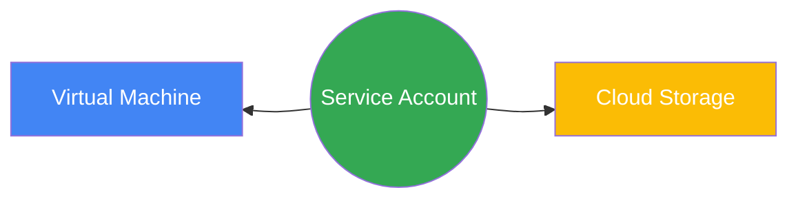

# Cuentas de Servicio (Service Accounts)

Las cuentas de servicio son un tipo especial de cuenta de Google diseñada para ser utilizada por aplicaciones, máquinas virtuales o cargas de trabajo en lugar de personas.

## Datos Clave y Buenas Prácticas

- **Autenticación mediante Claves Criptográficas:** A diferencia de las personas, las cuentas de servicio no tienen contraseñas; se autentican utilizando pares de claves criptográficas RSA (claves gestionadas por Google o por el usuario) para acceder a los recursos.
- **Doble Naturaleza (Identidad y Recurso):** Una cuenta de servicio actúa como una **identidad** (se le otorgan roles de IAM para que pueda acceder a otros recursos), pero al mismo tiempo **es considerada un recurso en sí misma**, lo que significa que puede tener sus propias políticas de IAM (para permitir que usuarios humanos tengan permisos para usarla o actuar como ella).
- **Cuentas de Servicio Predeterminadas (Default):** Al habilitar ciertas APIs, Google Cloud crea automáticamente cuentas de servicio por defecto (por ejemplo, para Compute Engine y App Engine).
- **Riesgo de Seguridad:** Por defecto, Google asigna el rol básico de **Editor** a la cuenta de servicio predeterminada de Compute Engine. Esto representa un gran riesgo de seguridad si una instancia de VM llega a ser comprometida.
- **Principio de Privilegio Mínimo:** La mejor práctica recomendada es **evitar el uso de las cuentas de servicio por defecto** en recursos de producción. En su lugar, se deben crear cuentas de servicio personalizadas (Custom Service Accounts) con los permisos mínimos específicos y necesarios.
- **Deshabilitar en lugar de Eliminar:** Si decides no utilizar las cuentas por defecto, la práctica recomendada es **deshabilitarlas** o **retirarles el rol de Editor** en el panel de IAM, en lugar de eliminarlas por completo (para evitar romper integraciones o dependencias automáticas no planificadas).
- **Políticas de Organización:** Puedes activar la restricción `constraints/iam.automaticIamGrantsForDefaultServiceAccounts` a nivel de nodo de organización para evitar que GCP otorgue el rol de Editor de forma automática a las cuentas por defecto en proyectos nuevos.

