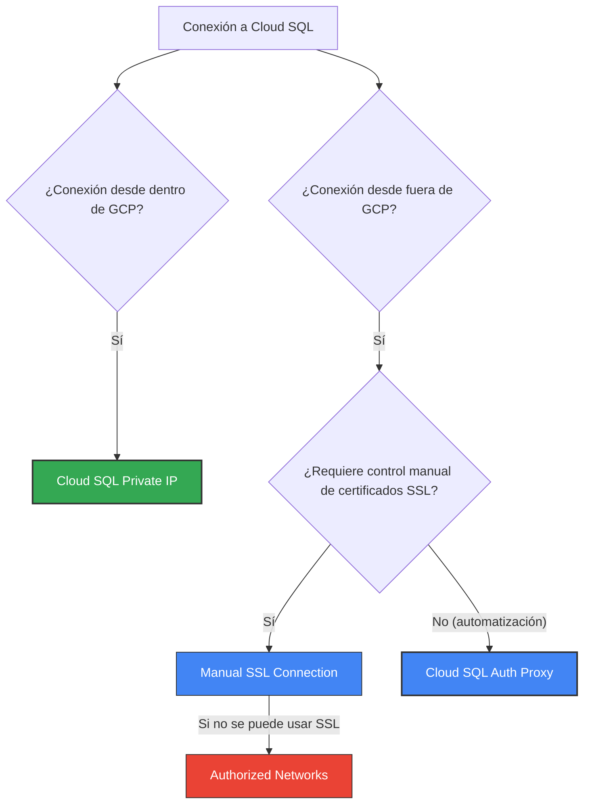

# Cloud SQL (Base de datos relacionales gestionadas)

## Descripción general
Google Cloud SQL es un servicio totalmente gestionado de bases de datos relacionales que soporta MySQL, PostgreSQL y SQL Server. Ofrece aprovisionamiento rápido, alta disponibilidad, copias de seguridad automáticas y escalado sencillo, permitiendo a los usuarios centrarse en sus aplicaciones sin gestionar la infraestructura de la base de datos.

## Características principales
- **Compatibilidad múltiple:** MySQL, PostgreSQL y SQL Server en una sola plataforma.
- **Alta disponibilidad:** Replicación sincrónica entre zonas para conmutación por error automática.
- **Copias de seguridad automáticas:** Backups diarios y restauración a puntos en el tiempo.
- **Escalado flexible:** Escala verticalmente la CPU y memoria; crea réplicas de lectura para distribuir carga.
- **Integración con VPC y IAM:** Conexiones mediante IP privada, control de acceso basado en roles y auditado con Cloud Logging.
- **Monitoreo y alertas:** Métricas y alertas integradas con Cloud Monitoring.

## Tipos de instancias
- **Instancia Zonal (Single-zone):** Una sola instancia en una zona. Ideal para desarrollo y pruebas. No tiene failover automático.
- **Instancia Regional (Alta disponibilidad - HA):** Configuración con una instancia primaria y una instancia de *standby* en una zona distinta de la misma región. Replicación sincrónica y failover automático.
  > [!IMPORTANT]
  > **Restricción de HA:** Cloud SQL **no** soporta Alta Disponibilidad (HA) multirregional síncrona. Su configuración de HA es estrictamente regional (zonal redundante dentro de la misma región). Para redundancia entre distintas regiones geográficas, se deben usar réplicas de lectura multirregionales (con replicación asincrónica).
- **Réplica de lectura:** Instancia de solo lectura con replicación asincrónica. Sirve para descargar la carga de consultas, pero NO actúa como failover de HA.

## Datos Clave
- **SLA:** 99.99% para configuraciones de Alta Disponibilidad (HA) y 99.95% para instancias zonales.
- **Conexión Segura:** Se recomienda el uso de **Cloud SQL Auth Proxy** para evitar la gestión manual de certificados SSL y la exposición de IPs.
- **Mantenimiento:** Las actualizaciones del sistema operativo y parches requieren ventanas de mantenimiento que pueden causar breves interrupciones del servicio.
- **Tamaño máximo por base de datos:** Hasta 64 TB (dependiendo del motor de base de datos).
- **Modelo de costes:** Facturación por hora de la instancia y por GB‑mes de almacenamiento; no hay inversión inicial (CapEx).
- **Cifrado en reposo:** Los datos se encriptan por defecto con claves gestionadas por Google; se puede usar CMEK para gestión propia de claves.
- **Transporte seguro:** Las conexiones utilizan TLS/SSL para proteger los datos en tránsito.
- **Backups y retención:** Cloud SQL mantiene 7 backups automáticos por defecto y los gestiona completamente; no es necesario preocuparse por actualizaciones o gestión de backups.
- **Disponibilidad y durabilidad:** SLA de 99.95 % para configuraciones HA; replicación automática entre zonas.

## Métodos de Conexión y Acceso

La forma de conectar con una instancia de Cloud SQL varía dependiendo de si el origen de la conexión está dentro o fuera del entorno de red de Google Cloud.

### Opciones de Conexión:

1. **Desde dentro de Google Cloud (VPC):**
   - **IP Privada (Private IP):** Configura acceso privado a servicios (Private Services Access). Permite conectar VMs o contenedores internos directamente mediante la red interna de GCP sin exponer la base de datos a internet. Es la opción más segura y recomendada internamente.

2. **Desde fuera de Google Cloud:**
   - **Cloud SQL Auth Proxy:** El estándar recomendado por Google. Es un cliente local que gestiona la autenticación y encriptación de forma automática con Cloud IAM y certificados efímeros, evitando abrir puertos públicos ni gestionar manualmente IPs en listas blancas o certificados SSL.
   - **Conexión SSL Manual (Manual SSL Connection):** Conexión clásica donde generas y descargas certificados SSL de cliente/servidor directamente desde la consola de GCP para securizar la comunicación.
   - **Redes Autorizadas (Authorized Networks):** Permite habilitar el acceso público restringiendo las IPs de origen autorizadas en una lista blanca. Es el método menos seguro y se utiliza principalmente cuando no se puede configurar SSL o utilizar el proxy.

## Enlaces relacionados
- **[Documentación oficial de Cloud SQL](https://cloud.google.com/sql)** – guía completa y referencia de la API.
- **[Guía de migración a Cloud SQL](https://cloud.google.com/sql/docs/mysql/migrate)** – pasos para migrar bases de datos existentes.
- **[Cifrado y gestión de claves](https://cloud.google.com/sql/docs/mysql/security/encryption)** – información sobre CMEK y cifrado en reposo.
- **[Monitoreo y alertas](https://cloud.google.com/sql/docs/mysql/monitoring)** – cómo usar Cloud Monitoring con Cloud SQL.
